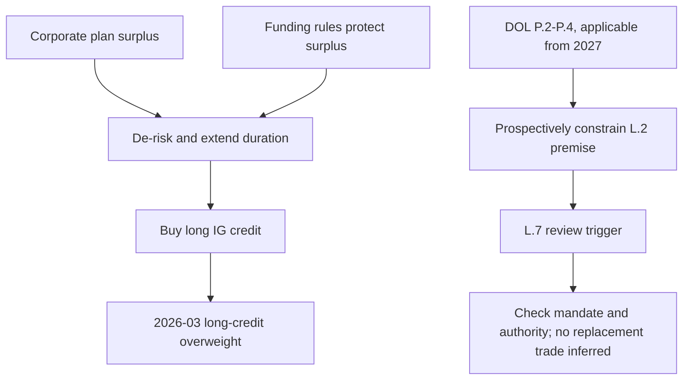

## Scope, edition, and applicability

This page records a **US Fixed Income Research** market view, not binding allocation guidance, a portfolio instruction, or client-specific investment advice. The underlying note is synthetic demonstration material and expressly disclaims research, recommendations, and investment advice. [FI-US-PENSION-LDI notice](repo://internal_research/FI/US/PENSION-LDI/2026-03.md#L1-L3)

**FI-US-PENSION-LDI, Edition 2026-03** was published on **2026-03-05**, applies to positions taken on or after **2026-04-01**, and changed the desk view from neutral to **overweight long-dated investment-grade credit**. [Edition header and publication](repo://internal_research/FI/US/PENSION-LDI/2026-03.md#L5-L14) The stated review trigger is the earlier of the twelve-month anniversary or an announced change to pension-funding or discount-rate rules. [L.7](repo://internal_research/FI/US/PENSION-LDI/2026-03.md#L44-L46)

The edition is a frozen historical record: research and external sources are not revised in place, and an edition remains the basis of record for positions taken while it stood. The prospective DOL overlay below therefore does not erase or rewrite the 2026-03 record; it changes how the load-bearing premise must be treated for future applicable plan years. [Corpus model](repo://README.md#L39-L48)

## The 2026-03 expression: a bounded long-end flow view

The overweight is a demand-and-supply-flow view, not an index valuation view. Corporate defined-benefit plans were expected to remain persistent buyers of long corporate paper through 2028, with demand large relative to net long-end issuance. [L.1](repo://internal_research/FI/US/PENSION-LDI/2026-03.md#L16-L18) The supply support is specific to that maturity segment: net long-dated corporate issuance had been below the stated demand for six quarters, and the desk did not expect issuers to close the gap while front-end funding remained cheaper. [L.3](repo://internal_research/FI/US/PENSION-LDI/2026-03.md#L26-L28)

The expression is bounded to the long end and **single-A and better** credit. The note rejects reaching down in quality because this is a flow call, not compensation for lower credit quality. [L.4](repo://internal_research/FI/US/PENSION-LDI/2026-03.md#L30-L32) A sharp rise in long-dated issuance and spread widening sufficient to make demand price-insensitive are separate risks to that expression. [L.6](repo://internal_research/FI/US/PENSION-LDI/2026-03.md#L38-L42)

## Load-bearing pension-demand premise and review path

The demand mechanism is surplus corporate plans de-risking—extending duration and shifting from return-seeking assets into long credit. The note reports aggregate funded status above 100% for eight consecutive quarters. [L.2](repo://internal_research/FI/US/PENSION-LDI/2026-03.md#L20-L22)

Its explicit **load-bearing pension-demand premise** is that funding rules make surplus worth protecting: contribution requirements and the liability discount-rate basis give sponsors a reason to lock in. If rules allow a sponsor to release or re-risk surplus, flow can reverse rather than merely slow and the overweight does not survive. The named invalidators are surplus release, a changed discount-rate basis, or reduced contribution requirements. [L.2](repo://internal_research/FI/US/PENSION-LDI/2026-03.md#L22-L24) [L.6](repo://internal_research/FI/US/PENSION-LDI/2026-03.md#L38-L40)

The diagram is the research mechanism and review control flow, not a portfolio instruction. [L.1-L.2 and L.7](repo://internal_research/FI/US/PENSION-LDI/2026-03.md#L16-L24) [L.7](repo://internal_research/FI/US/PENSION-LDI/2026-03.md#L44-L46) [DOL applicability and P.2-P.4](repo://external_sources/DOL/2026-08-funding-relief-and-discount-rates.md#L7-L25)

## Distinct scope from the broader IG view

Do not conflate this maturity-bucket flow view with **FI-US-IG-SPREADS, Edition 2025-09**. The LDI note says its long-end-specific overweight does not contradict the IG-spreads note’s index-level underweight because the latter is a valuation view on the index. [LDI L.5](repo://internal_research/FI/US/PENSION-LDI/2026-03.md#L34-L36)

The broader IG note is underweight because spreads were inside the tenth percentile of their twenty-year range and offered limited compensation for cyclical risk. It explicitly characterizes the concern as valuation, rather than credit deterioration, despite stable leverage and comfortable index-level interest coverage. [IG spreads G.1-G.3](repo://internal_research/FI/US/IG-SPREADS/2025-09.md#L16-L26) It identifies liability-driven-investor demand as the main counterargument; the LDI note instead isolates that demand in a long-maturity, single-A-and-better expression. [IG spreads G.4](repo://internal_research/FI/US/IG-SPREADS/2025-09.md#L28-L30) [LDI L.4-L.5](repo://internal_research/FI/US/PENSION-LDI/2026-03.md#L30-L36)

## Prospective DOL overlay: constraints and preserved boundaries

DOL Release 2026-31 was issued in 2026-08 and applies only to plan years beginning on or after **2027-01-01**. P.2 widens the corridor around twenty-five-year average segment rates from 10% to 20% in each direction, permitting a higher discount rate and lower measured liabilities. P.3 removes the minimum required contribution only where P.2 funded status exceeds 110%, and P.4 permits only specified uses of excess assets—transfer to a qualified replacement plan or application to retiree health accounts—subject to notice. [Release applicability and P.2](repo://external_sources/DOL/2026-08-funding-relief-and-discount-rates.md#L7-L17) [P.3-P.4](repo://external_sources/DOL/2026-08-funding-relief-and-discount-rates.md#L19-L25)

Those provisions prospectively constrain the 2026-03 L.2 premise: they affect its discount-rate measurement and contribution incentives, and allow limited surplus uses for qualifying plans. They do not erase the historical 2026-03 thesis or establish a replacement view. P.4 also does **not** permit sponsor reversion outside the existing statutory framework. [P.4](repo://external_sources/DOL/2026-08-funding-relief-and-discount-rates.md#L23-L25) [Historical-record rule](repo://README.md#L39-L48)

Separately, the release **preserves** benefit-accrual and vesting rules and all existing restrictions for plans below 80% funded. It does not address the fiduciary standards governing investment of plan assets, so it neither prescribes a long-credit trade nor supplies investment-manager authority. [P.5](repo://external_sources/DOL/2026-08-funding-relief-and-discount-rates.md#L27-L31) A sponsor electing P.3 relief must notify participants within 30 days. [P.6](repo://external_sources/DOL/2026-08-funding-relief-and-discount-rates.md#L33-L35)

## Mandate boundary

The announced rule change activates the research review trigger; it does not turn the release into an inferred replacement allocation. Identify the applicable mandate and authority before any implementation decision. [LDI L.7](repo://internal_research/FI/US/PENSION-LDI/2026-03.md#L44-L46) [Release P.5](repo://external_sources/DOL/2026-08-funding-relief-and-discount-rates.md#L27-L31)

The available US Taxable Account Fixed Income Allocation Guide contains binding municipal and index-level investment-grade-corporate weights, but identifies FI-US-MUNI-CREDIT 2025-06 and FI-US-IG-SPREADS 2025-09—not FI-US-PENSION-LDI 2026-03—as the notes on which it currently rests. Its cited-note suspension path therefore does not create an LDI-specific weight, suspension, or trade. [Allocation guide A.1 and A.8](repo://internal_guidelines/allocation/us-taxable-fixed-income.md#L7-L11) [Allocation guide A.3, A.5, and A.8](repo://internal_guidelines/allocation/us-taxable-fixed-income.md#L17-L23) [Allocation guide A.5](repo://internal_guidelines/allocation/us-taxable-fixed-income.md#L33-L37) [Allocation guide A.8](repo://internal_guidelines/allocation/us-taxable-fixed-income.md#L49-L51)

If a governing mandate does depend on research that has been superseded or withdrawn, the discretion matrix requires suspension of the affected research-derived weight and committee escalation. A manager may not carry the prior weight forward, re-derive it, or directly adopt a replacement research recommendation; adopting a binding weight is a committee act. This conditional control does not establish that FI-US-PENSION-LDI has been superseded. [Discretion matrix D.4](repo://internal_guidelines/authority/discretion-matrix.md#L31-L37)
