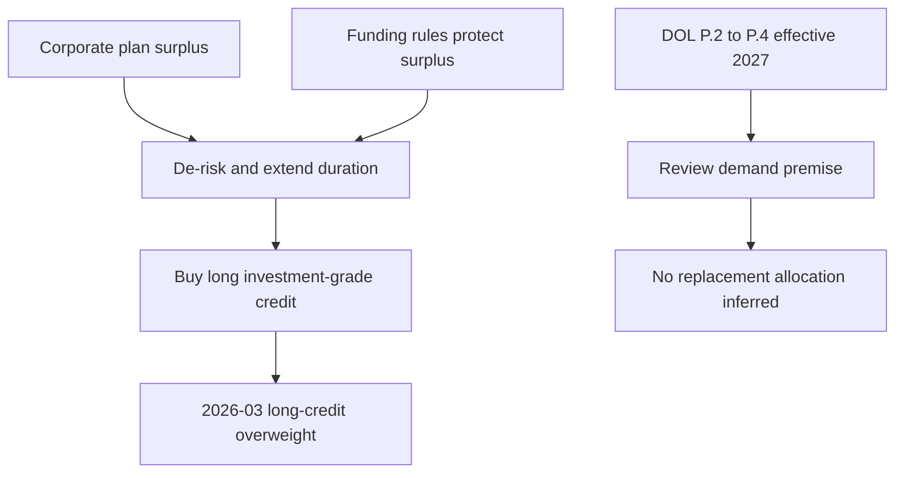

## Scope, edition, and applicability

This page records a **US Fixed Income Research** market view, not binding allocation guidance, a portfolio instruction, or client-specific investment advice. The underlying note is synthetic demonstration material and expressly disclaims research, recommendations, and investment advice. [FI-US-PENSION-LDI notice](repo://research/FI/US/PENSION-LDI/2026-03.md#L1-L3)

**FI-US-PENSION-LDI, Edition 2026-03** was published on **2026-03-05** and applies to positions taken on or after **2026-04-01**. It changed the desk view from neutral to **overweight long-dated investment-grade credit**. [FI-US-PENSION-LDI header and publication](repo://research/FI/US/PENSION-LDI/2026-03.md#L5-L14) Its stated review point is the earlier of its twelve-month anniversary or an announced change to pension-funding or discount-rate rules. [FI-US-PENSION-LDI L.7](repo://research/FI/US/PENSION-LDI/2026-03.md#L44-L46)

## The 2026-03 expression: a bounded long-end flow view

The overweight is a demand call, not a valuation call. The note expects corporate defined-benefit plans to remain persistent buyers of long corporate paper through 2028, with the expected flow large relative to net long-end issuance. [FI-US-PENSION-LDI L.1](repo://research/FI/US/PENSION-LDI/2026-03.md#L16-L18) The supply support is specific to that maturity segment: net long-dated corporate issuance had been below the stated demand for six quarters, and the desk did not expect issuers to close the gap while front-end funding remained cheaper. [FI-US-PENSION-LDI L.3](repo://research/FI/US/PENSION-LDI/2026-03.md#L26-L28)

The quality boundary is equally material: express the view at the long end in **single-A and better** credit. The note rejects reaching down in quality because this is a flow rather than a credit call. [FI-US-PENSION-LDI L.4](repo://research/FI/US/PENSION-LDI/2026-03.md#L30-L32) It also identifies a sharp rise in long-dated issuance and spread widening sufficient to make demand price-insensitive as separate risks to the expression. [FI-US-PENSION-LDI L.6](repo://research/FI/US/PENSION-LDI/2026-03.md#L38-L42)

## Load-bearing pension-surplus premise

The note attributes the expected demand to surplus corporate plans de-risking: extending duration and shifting from return-seeking assets into long credit. It reports aggregate funded status above 100% for eight consecutive quarters. [FI-US-PENSION-LDI L.2](repo://research/FI/US/PENSION-LDI/2026-03.md#L20-L22)

Its explicit **load-bearing assumption** is that funding rules make surplus worth protecting. Contribution requirements and the discount-rate basis for measuring liabilities give a sponsor an incentive to lock in; if rules permit a sponsor to release or re-risk surplus, the note says the flow can reverse rather than merely slow and the overweight does not survive. [FI-US-PENSION-LDI L.2](repo://research/FI/US/PENSION-LDI/2026-03.md#L22-L24) The named invalidation risks are a rule change permitting surplus release, changing the discount-rate basis, or reducing contribution requirements. [FI-US-PENSION-LDI L.6](repo://research/FI/US/PENSION-LDI/2026-03.md#L38-L40)

This diagram shows the research mechanism and the prospective review path; it does not turn either into a portfolio instruction. [FI-US-PENSION-LDI L.1–L.2](repo://research/FI/US/PENSION-LDI/2026-03.md#L16-L24) [DOL Release applicability and P.2–P.4](repo://bulletins/DOL/2026-08-funding-relief-and-discount-rates.md#L7-L25)

## Distinct scope from the index-level IG valuation view

The long-credit overweight and **FI-US-IG-SPREADS, Edition 2025-09** have distinct scopes; they must not be resolved into a single recommendation. The LDI note calls itself a long-end-specific flow view and says it does not contradict the IG-spreads note’s index-level underweight, which is a valuation view on the index. [FI-US-PENSION-LDI L.5](repo://research/FI/US/PENSION-LDI/2026-03.md#L34-L36)

The separate IG-spreads edition is underweight US investment-grade corporate credit because spreads were inside the tenth percentile of their twenty-year range and offered limited compensation for cyclical risk. It describes its concern as valuation rather than credit deterioration, notwithstanding stable leverage and comfortable interest coverage at the index level. [FI-US-IG-SPREADS G.1–G.3](repo://research/FI/US/IG-SPREADS/2025-09.md#L16-L26) That broad index view acknowledges liability-driven-investor demand as its principal counterargument, while the LDI view isolates pension-driven demand in a long-maturity, single-A-and-better expression. [FI-US-IG-SPREADS G.4](repo://research/FI/US/IG-SPREADS/2025-09.md#L28-L30) [FI-US-PENSION-LDI L.4–L.5](repo://research/FI/US/PENSION-LDI/2026-03.md#L30-L36)

## Announced funding-rule event and future effective-date actions

**DOL Release 2026-31 P.2–P.4 supersede the 2026-03 research premise prospectively for plan years beginning on or after 2027-01-01.** P.2 widens the discount-rate corridor around twenty-five-year average segment rates from 10% to 20%, permitting a higher discount rate and lower measured liabilities; P.3 removes the minimum required contribution for a plan above 110% funded under P.2; and P.4 conditionally permits specified uses of excess assets. [DOL Release P.2](repo://bulletins/DOL/2026-08-funding-relief-and-discount-rates.md#L13-L17) [DOL Release P.3–P.4](repo://bulletins/DOL/2026-08-funding-relief-and-discount-rates.md#L19-L25)

This is the announced event described by L.6: it changes the liability-measurement and contribution components of the premise and allows limited surplus uses for a qualifying sponsor. The P.4 permission is bounded: it permits transfer to a qualified replacement plan or application to retiree health accounts, subject to notice, and does not permit a sponsor reversion outside the existing statutory framework. [DOL Release P.3–P.4](repo://bulletins/DOL/2026-08-funding-relief-and-discount-rates.md#L19-L25) A sponsor electing P.3 relief must notify participants within 30 days. [DOL Release P.6](repo://bulletins/DOL/2026-08-funding-relief-and-discount-rates.md#L33-L35)

The event is prospective: the release was issued in 2026-08 and is effective only for plan years beginning on or after **2027-01-01**. It therefore triggers the note’s announced-rule review condition for future effective-date actions; it does not itself publish a replacement research view or prescribe a trade. [DOL Release notice and applicability](repo://bulletins/DOL/2026-08-funding-relief-and-discount-rates.md#L1-L7) [FI-US-PENSION-LDI L.7](repo://research/FI/US/PENSION-LDI/2026-03.md#L44-L46) The release also leaves benefit-accrual and vesting rules unchanged, preserves existing restrictions for plans below 80% funded, and does not address the fiduciary standards for investment of plan assets. [DOL Release P.5](repo://bulletins/DOL/2026-08-funding-relief-and-discount-rates.md#L27-L31)

For any implementation question, identify the applicable mandate and authority rather than treating this research record or the DOL overlay as self-executing. Where a mandate actually depends on superseded or withdrawn research, the discretion matrix requires suspension of the affected research-derived weight and committee escalation rather than manager re-derivation or direct adoption of replacement research. [Discretion matrix D.4](repo://guidelines/authority/discretion-matrix.md#L31-L37)
