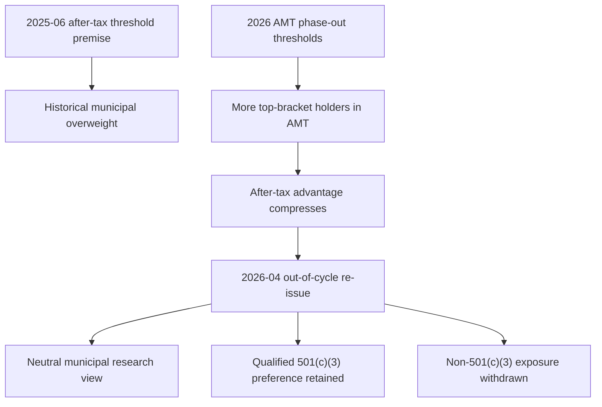

## Scope and edition status

This page records **US Fixed Income Research** positioning; it is not binding allocation guidance or client-specific investment advice. The underlying municipal notes label themselves synthetic demonstration material and not investment advice. [Municipal research 2026-04, notice](repo://research/FI/US/MUNI-CREDIT/2026-04.md#L1-L4)

**FI-US-MUNI-CREDIT, Edition 2026-04** is the current municipal research edition in this record: published on 2026-04-09, it applies to positions taken on or after **2026-05-01**, is neutral, and names the prior 2025-06 overweight as its predecessor. [Municipal research 2026-04, header and publication](repo://research/FI/US/MUNI-CREDIT/2026-04.md#L6-L18) **FI-US-MUNI-CREDIT, Edition 2026-04** supersedes **FI-US-MUNI-CREDIT, Edition 2025-06** in full for positions on or after that boundary; Edition 2025-06 remains the continuing basis of record for positions taken while it stood. [Municipal research 2026-04 M.1](repo://research/FI/US/MUNI-CREDIT/2026-04.md#L20-L27)

The superseded **Edition 2025-06**, published 2025-06-12, applies to positions taken on or after **2025-07-01** until the successor boundary. It moved municipal credit from neutral to overweight, expressed as a two-to-four percentage-point taxable-fixed-income-sleeve increase funded from investment-grade corporate credit and concentrated in high-yield and lower-investment-grade private-activity bonds. Its file separately confirms that it continues to govern review of positions taken while it stood. [Municipal research 2025-06, status and applicability](repo://research/FI/US/MUNI-CREDIT/2025-06.md#L1-L5) [Municipal research 2025-06 M.1](repo://research/FI/US/MUNI-CREDIT/2025-06.md#L20-L24)

## Why the historical overweight was withdrawn

For **Edition 2025-06**, private-activity bonds were an after-tax—not a pre-tax spread—case for top federal-bracket holders. The thesis depended on most of that client base being outside AMT under the then-effective phase-out thresholds; the note calls that threshold premise load-bearing and says the recommendation would not survive a reduction that drew materially more of those holders into AMT. Its fundamentals supported only neutral to modest overweight absent that premise. [Municipal research 2025-06 M.2–M.3](repo://research/FI/US/MUNI-CREDIT/2025-06.md#L26-L40)

For taxable years beginning on or after **2026-01-01**, Revenue Procedure 2025-41 sets AMT exemption amounts of $90,100 for an unmarried individual other than a surviving spouse and $140,200 for married joint filers or surviving spouses. It reduces the exemption by $0.25 for each dollar of AMTI above $500,000 for an unmarried filer or $1,000,000 for a joint return; the thresholds are not indexed before 2030-01-01. [Revenue Procedure 2025-41 N.2–N.3](repo://bulletins/IRS/2025-08-rev-proc-2025-41-amt-thresholds.md#L14-L22)

**FI-US-MUNI-CREDIT, Edition 2026-04** was re-issued out of cycle in response to that procedure under the prior M.8 trigger. It models the new thresholds as putting a majority of the formerly assumed-outside-AMT top-bracket client base inside AMT in 2026, compressing the historical 90–110-basis-point after-tax advantage to about 15 basis points, inside transaction costs. It therefore withdraws the overweight rather than supporting it on the prior fundamental case alone. [Municipal research 2026-04, publication](repo://research/FI/US/MUNI-CREDIT/2026-04.md#L16-L18) [Municipal research 2026-04 M.2](repo://research/FI/US/MUNI-CREDIT/2026-04.md#L29-L53)

This lifecycle shows the historical research rationale and its replacement; it does not select a portfolio weight. [Municipal research 2025-06 M.2, M.8](repo://research/FI/US/MUNI-CREDIT/2025-06.md#L26-L34) [Municipal research 2025-06 M.8](repo://research/FI/US/MUNI-CREDIT/2025-06.md#L72-L74) [Municipal research 2026-04 M.1–M.3](repo://research/FI/US/MUNI-CREDIT/2026-04.md#L20-L24) [Municipal research 2026-04 M.3](repo://research/FI/US/MUNI-CREDIT/2026-04.md#L55-L67)

## Current municipal expression: distinguish bond treatment

Revenue Procedure 2025-41 preserves specified private-activity-bond interest as an AMT preference item included in AMTI and does not modify the relevant definition. The threshold event thus changed the population for whom that treatment is operative; it did not repeal the treatment. [Revenue Procedure 2025-41 N.4](repo://bulletins/IRS/2025-08-rev-proc-2025-41-amt-thresholds.md#L24-L28)

Revenue Procedure 2025-41 preserves the separate qualified-501(c)(3) exception: interest on a qualified section 145 bond is neither an AMT preference item nor included in AMTI, and N.2–N.3 do not affect that treatment. [Revenue Procedure 2025-41 N.5](repo://bulletins/IRS/2025-08-rev-proc-2025-41-amt-thresholds.md#L30-L34)

Accordingly, **Edition 2026-04** withdraws the broad private-activity concentration and retains only a modest preference for qualified-501(c)(3) obligations of nonprofit hospitals and private higher education. The historical note identifies those two sectors as predominantly qualified 501(c)(3) issuance; it identifies airport special-facility paper as predominantly non-501(c)(3), and the successor withdraws that airport preference in full. [Municipal research 2026-04 M.1, M.3](repo://research/FI/US/MUNI-CREDIT/2026-04.md#L20-L24) [Municipal research 2026-04 M.3](repo://research/FI/US/MUNI-CREDIT/2026-04.md#L55-L67) [Municipal research 2025-06 M.5](repo://research/FI/US/MUNI-CREDIT/2025-06.md#L48-L54)

Within the neutral view, **Edition 2026-04** recommends no new non-501(c)(3) private-activity positions, but does not recommend forced sales of existing positions; it favors orderly reduction for execution reasons. It retains the eight-to-fifteen-year curve preference and continues to find the front end unattractive. These are research conclusions, not binding transition instructions. [Municipal research 2026-04 M.4](repo://research/FI/US/MUNI-CREDIT/2026-04.md#L69-L78) [Municipal research 2026-04 M.6](repo://research/FI/US/MUNI-CREDIT/2026-04.md#L86-L89)

## Separate investment-grade funding view

**FI-US-IG-SPREADS, Edition 2025-09** is a separate US investment-grade corporate-credit view, published 2025-09-18 and effective for positions on or after **2025-10-01**. It is underweight, rather than a restatement of either municipal edition. [IG-spreads research, header and publication](repo://research/FI/US/IG-SPREADS/2025-09.md#L5-L14)

Its rationale is valuation: spreads were inside the tenth percentile of their twenty-year range, while leverage and interest coverage were stable. The note characterizes the concern as valuation rather than credit deterioration. Its positioning is an approximately four-percentage-point taxable-fixed-income-sleeve underweight, with proceeds available to fund a higher-conviction sleeve position rather than cash. [IG-spreads research G.1–G.3](repo://research/FI/US/IG-SPREADS/2025-09.md#L16-L26) [IG-spreads research G.5](repo://research/FI/US/IG-SPREADS/2025-09.md#L32-L34)

## Research-to-mandate boundary

The US Taxable Account Fixed Income Allocation Guide implements the historical 2025-06 research as a 22% municipal target versus 18% neutral for top-bracket accounts and a 28% IG-corporate target versus 32% neutral. Those are committee-set mandate weights, not outputs of this research page. [Allocation guide A.3](repo://guidelines/allocation/us-taxable-fixed-income.md#L17-L23) [Allocation guide A.5](repo://guidelines/allocation/us-taxable-fixed-income.md#L33-L37)

The guide states that a weight based on a superseded or withdrawn cited note is suspended until committee re-adoption. For its paired municipal/IG trade, suspension of the municipal overweight suspends the IG underweight and returns both to their neutral references; a suspension-caused band condition is not automatically rebalanced as drift. The discretion matrix requires escalation rather than manager re-derivation, carry-forward, or direct adoption of the successor research view. [Allocation guide A.1](repo://guidelines/allocation/us-taxable-fixed-income.md#L7-L11) [Allocation guide A.5–A.6](repo://guidelines/allocation/us-taxable-fixed-income.md#L33-L43) [Discretion matrix D.4](repo://guidelines/authority/discretion-matrix.md#L31-L35)
