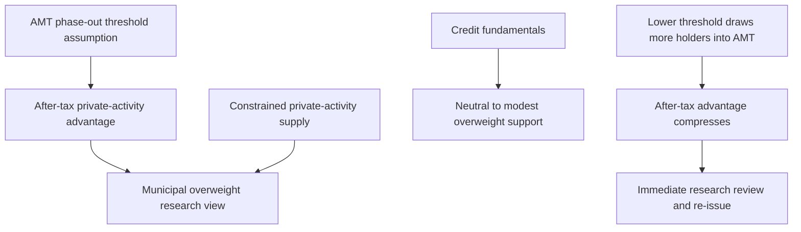

## Scope and status

This is a research record, not binding allocation guidance, a client-specific recommendation, or a trade instruction. The underlying municipal and investment-grade notes are synthetic demonstration material and expressly are not investment advice. [Municipal research, notice](repo://internal_research/FI/US/MUNI-CREDIT/2025-06.md#L1-L3) [IG-spreads research, notice](repo://internal_research/FI/US/IG-SPREADS/2025-09.md#L1-L3)

**FI-US-MUNI-CREDIT, Edition 2025-06** is marked current and not re-issued since publication. It was published on 2025-06-12 and applies to positions taken on or after **2025-07-01**. The note identifies itself as the basis of record for municipal weightings in the taxable-account allocation guidance, and the guide adopts its municipal overweight from M.1 and after-tax analysis from M.2. [Municipal research, status and applicability](repo://internal_research/FI/US/MUNI-CREDIT/2025-06.md#L12-L16) [Allocation guide A.3](repo://internal_guidelines/allocation/us-taxable-fixed-income.md#L17-L23)

## Municipal view: an AMT-sensitive after-tax overweight

The municipal research moves US municipal credit from neutral to overweight. It expresses the view as a **two-to-four percentage-point** increase within the taxable fixed-income sleeve, funded from investment-grade corporate credit and concentrated in high-yield and lower-investment-grade private-activity bonds. The stated case combines an after-tax advantage with expected constrained private-activity supply through 2027; it is not a generic pre-tax spread view. [Municipal research M.1](repo://internal_research/FI/US/MUNI-CREDIT/2025-06.md#L18-L22) [Municipal research M.2](repo://internal_research/FI/US/MUNI-CREDIT/2025-06.md#L24-L32) [Municipal research M.4](repo://internal_research/FI/US/MUNI-CREDIT/2025-06.md#L40-L44)

The tax premise is load-bearing. Private-activity paper trades inside comparable corporate credit before tax for most ratings; the advantage arises after tax and only for top federal-bracket holders. The note assumes that most of its top-bracket client base remains outside AMT under the then-effective exemption phase-out thresholds. It says a threshold reduction that brings materially more of those holders into AMT compresses the advantage toward zero and means the recommendation does not survive. Credit fundamentals—strong tax receipts and rainy-day balances, low defaults, and stronger recoveries relative to comparable corporates—support only neutral to modest overweight on their own. [Municipal research M.2–M.3](repo://internal_research/FI/US/MUNI-CREDIT/2025-06.md#L24-L38)

The supply support is independent of that AMT premise: the note reports issuance below the ten-year average for six consecutive quarters, suppressed refunding volume, and expected negative net supply in the private-activity segment through 2027. A reversal in that supply picture, especially a statutory increase in the private-activity volume cap, is a separate risk. [Municipal research M.4 and M.7](repo://internal_research/FI/US/MUNI-CREDIT/2025-06.md#L40-L44) [Municipal research M.7](repo://internal_research/FI/US/MUNI-CREDIT/2025-06.md#L58-L68)

This diagram shows the note's stated thesis and invalidation path, not a portfolio-weight selection rule. [Municipal research M.2–M.4](repo://internal_research/FI/US/MUNI-CREDIT/2025-06.md#L24-L44) [Municipal research M.8](repo://internal_research/FI/US/MUNI-CREDIT/2025-06.md#L70-L72)

### Bond and sector boundaries

The overweight is directed to the eight-to-fifteen-year part of the municipal curve. The note does not recommend duration beyond 15 years or the front end, where it judges the after-tax advantage smallest and least durable. Within the private-activity segment, it prefers nonprofit hospital systems, private higher education, and large-hub airport special-facility paper, while it is underweight standalone senior living, single-asset student housing, and single-obligor industrial-development paper regardless of rating. [Municipal research M.5–M.6](repo://internal_research/FI/US/MUNI-CREDIT/2025-06.md#L46-L56)

The first two preferred sectors are predominantly qualified section 145 501(c)(3) bonds, while airport special-facility paper predominantly is not. That distinction matters because qualified 501(c)(3) interest has different AMT treatment; it should not be collapsed into a single private-activity-bond exposure. [Municipal research M.5](repo://internal_research/FI/US/MUNI-CREDIT/2025-06.md#L46-L52)

## AMT regulatory overlay: constraint, not allocation action

Revenue Procedure 2025-41 applies to taxable years beginning on or after **2026-01-01**. It sets AMT exemption amounts of $90,100 for an unmarried individual other than a surviving spouse and $140,200 for joint filers or surviving spouses. The exemption is reduced by $0.25 per dollar of AMTI above $500,000 for an unmarried filer and $1,000,000 for a joint return; those thresholds are not indexed before 2030-01-01. [Revenue Procedure 2025-41 N.2–N.3](repo://external_sources/IRS/2025-08-rev-proc-2025-41-amt-thresholds.md#L14-L22)

Those provisions constrain the municipal note's threshold assumption: M.2 used then-effective phase-out amounts that did not reach zero until $978,750 for a single filer and $1,800,700 for joint filers, whereas the procedure sets the new $500,000 and $1,000,000 thresholds. The procedure also says taxpayers above the applicable new threshold are subject to the specified-private-activity-bond treatment even if they were not under prior thresholds; the research identifies a reduction drawing more top-bracket holders into AMT as the event that defeats its after-tax rationale. The procedure does **not** itself select, suspend, or otherwise change a portfolio weight. [Municipal research M.2](repo://internal_research/FI/US/MUNI-CREDIT/2025-06.md#L24-L32) [Revenue Procedure 2025-41 N.2–N.4](repo://external_sources/IRS/2025-08-rev-proc-2025-41-amt-thresholds.md#L14-L28)

The procedure preserves both relevant bond-treatment provisions. Specified private-activity-bond interest remains a tax-preference item included in AMTI, and its definition is unchanged. Separately, interest on a qualified section 145 501(c)(3) bond is neither a preference item nor included in AMTI; the procedure expressly says its new exemption amounts and thresholds do not affect that treatment. [Revenue Procedure 2025-41 N.4](repo://external_sources/IRS/2025-08-rev-proc-2025-41-amt-thresholds.md#L24-L28) [Revenue Procedure 2025-41 N.5](repo://external_sources/IRS/2025-08-rev-proc-2025-41-amt-thresholds.md#L30-L34)

The municipal note has a lifecycle control: it is reviewed at its twelve-month anniversary or an announced change to federal tax treatment of municipal interest, whichever is earlier, and a change to the treatment described in its after-tax case requires immediate review and re-issue. This is a research-review trigger, not an allocation instruction. [Municipal research M.8](repo://internal_research/FI/US/MUNI-CREDIT/2025-06.md#L70-L72)

## Separate investment-grade corporate-credit view

**FI-US-IG-SPREADS, Edition 2025-09** is a distinct research view. Published 2025-09-18 and effective for positions taken on or after **2025-10-01**, it moves US investment-grade corporate credit from neutral to underweight. The note describes the underweight as approximately four percentage points within a taxable fixed-income sleeve, with proceeds available for a higher-conviction sleeve position rather than cash. [IG-spreads research, status and positioning](repo://internal_research/FI/US/IG-SPREADS/2025-09.md#L5-L14) [IG-spreads research G.5](repo://internal_research/FI/US/IG-SPREADS/2025-09.md#L32-L34)

Its rationale is valuation, not a claim of deteriorating corporate credit: spreads are inside the tenth percentile of their twenty-year range while leverage is stable and interest coverage remains comfortable. Liability-driven demand is the principal counterargument; continuation of that technical, growth acceleration, and carry cost are identified risks. This valuation view is separate from the municipal after-tax thesis even where corporate exposure is a funding source for the municipal expression. [IG-spreads research G.1–G.4](repo://internal_research/FI/US/IG-SPREADS/2025-09.md#L16-L30) [IG-spreads research G.6](repo://internal_research/FI/US/IG-SPREADS/2025-09.md#L36-L38)

## Research-to-mandate boundary

The US Taxable Account Fixed Income Allocation Guide, rather than either research note, sets binding account weights. For top-bracket accounts it specifies a 22% municipal target versus 18% neutral and a 28% investment-grade-corporate target versus 32% neutral; it deliberately links the corporate underweight as funding for the municipal overweight. These guide weights are committee-set implementation, not weights selected by this page, the municipal note, or the IRS procedure. [Allocation guide A.1 and A.3](repo://internal_guidelines/allocation/us-taxable-fixed-income.md#L7-L11) [Allocation guide A.3](repo://internal_guidelines/allocation/us-taxable-fixed-income.md#L17-L23) [Allocation guide A.5](repo://internal_guidelines/allocation/us-taxable-fixed-income.md#L33-L37)

The guide defines a conditional governance path if a cited note is later superseded or withdrawn: its derived weight is suspended until committee re-adoption, the linked municipal and corporate offsets return to neutral together, and a suspension-caused band condition is escalated rather than mechanically rebalanced. That control does not make this research record a mandate or authorize a manager to derive a replacement weight. [Allocation guide A.1](repo://internal_guidelines/allocation/us-taxable-fixed-income.md#L7-L11) [Allocation guide A.5–A.6](repo://internal_guidelines/allocation/us-taxable-fixed-income.md#L33-L43)
