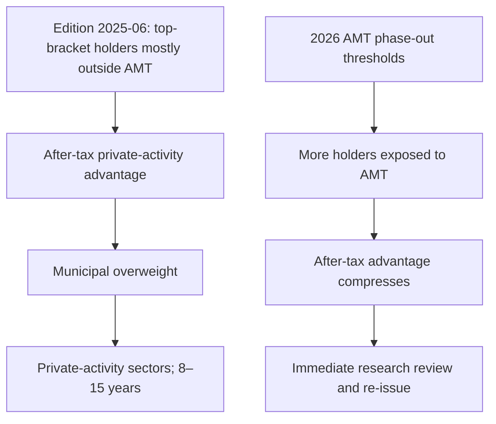

## Research views and scope

**FI-US-MUNI-CREDIT, Edition 2025-06** is a US Fixed Income Research view published 2025-06-12 and applicable to positions taken on or after 2025-07-01. It moved US municipal credit from neutral to **overweight**. The recommended increase is two to four percentage points within the taxable fixed-income sleeve, funded from investment-grade corporate credit, and concentrated in high-yield and lower-investment-grade private-activity bonds. This records a research view—not binding portfolio guidance or client-specific investment advice. [Municipal research, header and M.1](repo://research/FI/US/MUNI-CREDIT/2025-06.md#L1-L20)

**FI-US-IG-SPREADS, Edition 2025-09** is a separate US Fixed Income Research view, published 2025-09-18 and applicable to positions taken on or after 2025-10-01. It moved US investment-grade corporate credit from neutral to **underweight by approximately four percentage points** within a taxable fixed-income sleeve; the proceeds are available for a higher-conviction sleeve position rather than cash. Its stated case is valuation—spreads inside the tenth percentile of their 20-year range—not credit deterioration. [IG-spreads research, header and G.1–G.5](repo://research/FI/US/IG-SPREADS/2025-09.md#L1-L34)

The two editions should not be conflated. **Edition 2025-06** supplies the municipal thesis and says corporate credit funds it; **Edition 2025-09** separately supplies an IG underweight based on valuation. Any binding 22%/28% implementation is an Investment Policy Committee decision in the allocation guide, not an instruction issued by either research note. [Municipal research M.1](repo://research/FI/US/MUNI-CREDIT/2025-06.md#L16-L20) [IG-spreads research G.3–G.5](repo://research/FI/US/IG-SPREADS/2025-09.md#L24-L34) [Allocation Guide A.3 and A.5](repo://guidelines/allocation/us-taxable-fixed-income.md#L17-L37)

## Municipal thesis: the load-bearing AMT assumption

For **Edition 2025-06**, the private-activity-bond case is explicitly an **after-tax case, not a spread case**: on a pre-tax basis the paper generally trades inside comparable corporate credit, and the advantage is stated to arise only for top-federal-bracket holders. The note recognizes specified post-1986 private-activity-bond interest as an AMT preference item under section 57(a)(5)(A), but its then-current threshold premise was that most of its top-bracket client base lay outside AMT, so that preference was not operative for those clients. [Municipal research M.2](repo://research/FI/US/MUNI-CREDIT/2025-06.md#L22-L30)

This threshold premise is the note's stated **“load-bearing assumption.”** **Edition 2025-06** says that a phase-out-threshold reduction drawing a materially larger share of top-bracket holders into AMT compresses the after-tax advantage toward zero and means the M.1 recommendation does not survive. Credit fundamentals independently support only neutral to modest overweight; constrained private-activity supply is independent technical support, but neither supports the full recommended overweight on its own. [Municipal research M.2–M.4](repo://research/FI/US/MUNI-CREDIT/2025-06.md#L22-L42)

The diagram represents the research note's conditional logic. It does not prescribe a client allocation or imply that every municipal bond receives the same tax treatment. [Municipal research M.2, M.5–M.8](repo://research/FI/US/MUNI-CREDIT/2025-06.md#L22-L30) [Municipal research M.5–M.8](repo://research/FI/US/MUNI-CREDIT/2025-06.md#L44-L70)

## Edition 2025-06 expression and differentiated AMT exposure

**Edition 2025-06** expresses the overweight in the **eight-to-fifteen-year** part of the municipal curve. It does not recommend duration beyond 15 years at current ratios or the front end, where the stated after-tax advantage is smallest in absolute terms and least durable. [Municipal research M.6](repo://research/FI/US/MUNI-CREDIT/2025-06.md#L52-L54)

Within the private-activity segment, **Edition 2025-06** prefers: (1) nonprofit hospital systems with demonstrated pricing power and at least three years of positive operating margin; (2) private higher education with endowment coverage above four times annual operating expense; and (3) airport special-facility paper at large hubs with signatory-carrier agreements beyond 2035. It is underweight standalone senior living, single-asset student housing, and single-obligor industrial-development paper regardless of rating. [Municipal research M.5](repo://research/FI/US/MUNI-CREDIT/2025-06.md#L44-L50)

IRS Revenue Procedure 2025-41 N.5 **preserves** FI-US-MUNI-CREDIT Edition 2025-06 M.5's differentiated exposure: qualified section 145 501(c)(3) bonds are not private activity bonds for this purpose, and their interest “is not an item of tax preference and is not included in alternative minimum taxable income.” The note identifies the hospital and higher-education preferences as predominantly qualified 501(c)(3) bonds, while airport special-facility paper predominantly is not. [IRS Revenue Procedure 2025-41 N.5](repo://bulletins/IRS/2025-08-rev-proc-2025-41-amt-thresholds.md#L30-L34) [Municipal research M.5](repo://research/FI/US/MUNI-CREDIT/2025-06.md#L44-L50)

## The regulatory event and research lifecycle

For taxable years beginning on or after **2026-01-01**, Revenue Procedure 2025-41 N.2 sets AMT exemptions of $90,100 for an unmarried individual other than a surviving spouse and $140,200 for married joint filers or surviving spouses. N.3 reduces the exemption by 25 cents per dollar of AMTI above $500,000 for an unmarried taxpayer and $1,000,000 for a joint return; these thresholds are not section 1(f)-indexed before 2030-01-01. [IRS Revenue Procedure 2025-41 N.2–N.3](repo://bulletins/IRS/2025-08-rev-proc-2025-41-amt-thresholds.md#L14-L22)

IRS Revenue Procedure 2025-41 N.3 **supersedes** FI-US-MUNI-CREDIT Edition 2025-06 M.2's threshold premise for those taxable years. The event changes the AMT population to which the unchanged preference can apply; it does not say that municipal credit generally, or all private-activity interest, is federally taxable. N.4 states that specified private-activity-bond interest “remains an item of tax preference” and does not modify the relevant bond definition. [IRS Revenue Procedure 2025-41 N.3–N.4](repo://bulletins/IRS/2025-08-rev-proc-2025-41-amt-thresholds.md#L18-L28) [Municipal research M.2](repo://research/FI/US/MUNI-CREDIT/2025-06.md#L22-L30)

IRS Revenue Procedure 2025-41 N.4 **preserves** FI-US-MUNI-CREDIT Edition 2025-06 M.2's preference-item treatment. The invalidation is therefore of the research note's threshold-dependent after-tax rationale, rather than a repeal of the preference treatment. **Edition 2025-06** remains the basis of record for positions taken under its stated applicability; it is not retroactively rewritten. [IRS Revenue Procedure 2025-41 N.4](repo://bulletins/IRS/2025-08-rev-proc-2025-41-amt-thresholds.md#L24-L28) [Municipal research, applicability and M.2](repo://research/FI/US/MUNI-CREDIT/2025-06.md#L12-L14) [Municipal research M.2](repo://research/FI/US/MUNI-CREDIT/2025-06.md#L22-L30)

**Edition 2025-06** requires immediate review and re-issue—not scheduled review—when the M.2 tax treatment changes. That is a research lifecycle trigger, not authority for a portfolio manager to calculate a replacement municipal or corporate weight. [Municipal research M.7–M.8](repo://research/FI/US/MUNI-CREDIT/2025-06.md#L56-L70) [Discretion Matrix D.4](repo://guidelines/authority/discretion-matrix.md#L31-L35)

## Implementation boundary for the paired trade

The US Taxable Account Fixed Income Allocation Guide A.3 and A.5 **constrain** the two research views in taxable accounts by setting the committee's 22% municipal target for top-bracket clients (18% neutral) and 28% IG-corporate target (32% neutral). The guide pairs the four-point municipal overweight with the four-point corporate underweight, specifies the private-activity concentration for qualifying top-bracket accounts, and returns below-top-bracket accounts to the 18% municipal neutral without that concentration. [Allocation Guide A.3 and A.5](repo://guidelines/allocation/us-taxable-fixed-income.md#L17-L37) [Municipal research M.1–M.2](repo://research/FI/US/MUNI-CREDIT/2025-06.md#L16-L30) [IG-spreads research G.5](repo://research/FI/US/IG-SPREADS/2025-09.md#L32-L34)

If a cited research note is superseded or withdrawn, Allocation Guide A.1 **constrains** the resulting weight: it is suspended rather than carried forward until committee re-adoption. A.5 couples the response for this pair—suspending the municipal overweight also suspends the corporate underweight and returns both to neutral—while A.6 says the resulting condition is not automatically rebalanced as ordinary drift. The manager escalates rather than deriving or directly adopting a replacement. [Allocation Guide A.1 and A.5–A.6](repo://guidelines/allocation/us-taxable-fixed-income.md#L7-L11) [Allocation Guide A.5–A.6](repo://guidelines/allocation/us-taxable-fixed-income.md#L33-L43) [Discretion Matrix D.4](repo://guidelines/authority/discretion-matrix.md#L31-L35)
