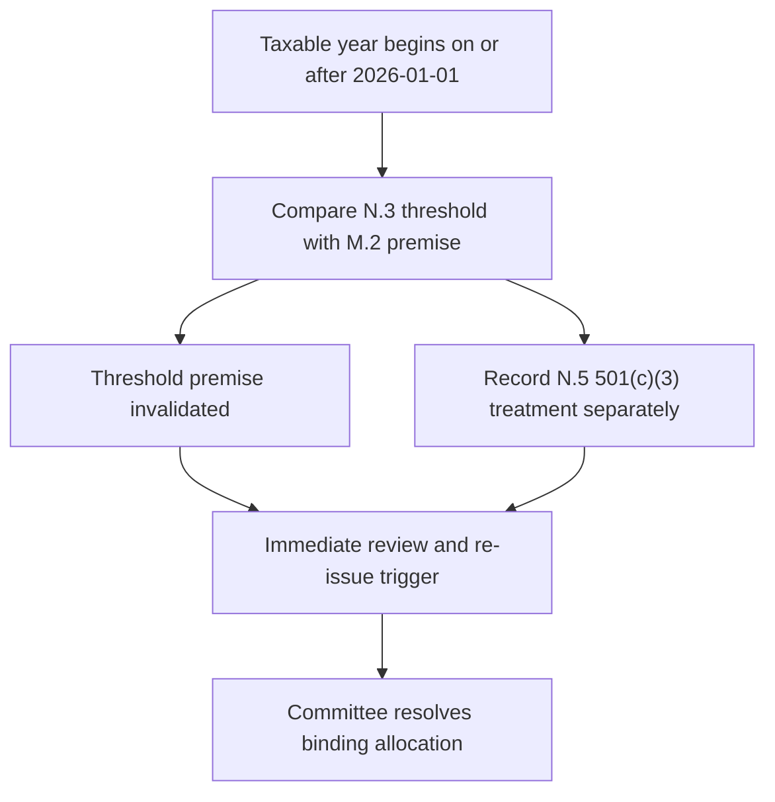

## Edition, scope, and authority boundary

This is a **market-view** record for `FI-US-MUNI-CREDIT` edition **2025-06**, not allocation guidance, tax advice, or a replacement research recommendation. US Fixed Income Research published the edition on 2025-06-12; it applies to positions taken on or after 2025-07-01, describes itself as current and not re-issued, and is the basis of record for taxable-account municipal weightings. Its positions-in-force period therefore begins 2025-07-01; for positions taken while it stood, retain this frozen edition as the historical decision record. [2025-06 status and applicability](repo://internal_research/FI/US/MUNI-CREDIT/2025-06.md#L12-L16) [frozen-authority convention](repo://README.md#L41-L48)

The research desk moved US municipal credit from neutral to overweight. The intended expression was a two-to-four-percentage-point increase in the taxable fixed-income sleeve, funded from investment-grade corporate credit, concentrated in high-yield and lower-investment-grade private activity bonds. This is primarily an after-tax spread view, not a standalone credit call. [M.1](repo://internal_research/FI/US/MUNI-CREDIT/2025-06.md#L18-L22)

The allocation guide—not this note—turns research into a binding target. For top federal marginal-bracket clients it sets municipal credit at 22% versus an 18% neutral and states that the four-point overweight and private-activity concentration rest on M.1/M.2; clients below that bracket remain at the 18% neutral without the concentration. It pairs a 28% IG-corporate target, versus 32% neutral, as the funding source. [allocation guide A.3 and A.5](repo://internal_guidelines/allocation/us-taxable-fixed-income.md#L17-L23) [allocation guide A.5](repo://internal_guidelines/allocation/us-taxable-fixed-income.md#L33-L37)

## Load-bearing after-tax mechanism

Specified post-1986 private activity bond interest enters alternative minimum taxable income (AMTI) as a tax-preference item. The note expected that statutory treatment to persist, but its 90–110 bp pickup for top-bracket holders depended on most such clients remaining outside AMT: its stated then-current phase-out-to-zero amounts were $978,750 for a single filer and $1,800,700 for joint filers. The note is explicit that “**The threshold is what does the work**”; credit fundamentals alone support neutral to modest overweight, and a sufficiently lower phase-out threshold would pull top-bracket holders into AMT, compress the pickup, and take M.1 with it. [M.2](repo://internal_research/FI/US/MUNI-CREDIT/2025-06.md#L24-L32)

**IRS Revenue Procedure 2025-41 N.3 supersedes the threshold-dependent basis in FI-US-MUNI-CREDIT 2025-06 M.2 for taxable years beginning on or after 2026-01-01.** The acted-on provision identifies the threshold as the condition carrying the additional allocation and its failure condition; the acting provision says the AMT exemption is “**reduced by twenty-five cents for each dollar**” of AMTI over $500,000 for an unmarried taxpayer and $1,000,000 for joint filers, and applies that treatment above the threshold regardless of prior thresholds. Those new thresholds invalidate the note’s stated expectation that most of the top-bracket book avoids AMT through the former threshold. This is a premise-level supersession, not a reissue or withdrawal of the research edition and not a new pickup estimate. [M.2 and M.7](repo://internal_research/FI/US/MUNI-CREDIT/2025-06.md#L28-L32) [N.3 and effective date](repo://external_sources/IRS/2025-08-rev-proc-2025-41-amt-thresholds.md#L18-L22) [N.8](repo://external_sources/IRS/2025-08-rev-proc-2025-41-amt-thresholds.md#L44-L46)

The overlay does **not** repeal the preference. N.4 says interest on a specified private activity bond “**remains an item of tax preference**” under section 57(a)(5)(A) and remains included in AMTI; it also retains the post-1986, section-141/private-activity definition boundary. The failed premise is the assumed threshold protection, not the existence of AMT preference treatment. [N.4](repo://external_sources/IRS/2025-08-rev-proc-2025-41-amt-thresholds.md#L24-L28)

## Preserved qualified-501(c)(3) boundary and implementation

**IRS Revenue Procedure 2025-41 N.5 preserves the qualified-501(c)(3) treatment identified in FI-US-MUNI-CREDIT 2025-06 M.5.** M.5 says the preferred nonprofit hospitals and private higher-education issuers are predominantly qualified 501(c)(3) bonds, whereas preferred airport special-facility paper predominantly is not. N.5 supplies the controlling language: “**private activity bond … does not include any qualified 501(c)(3) bond as defined in section 145**”; its interest “**is not an item of tax preference and is not included in alternative minimum taxable income**.” It further says, “**Nothing in N.2 or N.3 applies**” and that this treatment is “**preserved in full and is unaffected**.” [M.5](repo://internal_research/FI/US/MUNI-CREDIT/2025-06.md#L46-L52) [N.5](repo://external_sources/IRS/2025-08-rev-proc-2025-41-amt-thresholds.md#L30-L34)

That preservation is an issuer/treatment boundary, not a restoration of the overall private-activity overweight. The research ranks nonprofit hospitals meeting pricing-power and operating-margin conditions, private higher education with endowment coverage above four times annual operating expense, and qualifying airport special-facility paper; it is underweight standalone senior living, single-asset student housing, and single-obligor industrial development paper. The binding guide caps any preferred sector at 35% of municipal allocation and requires approval for the underweight sectors. [M.5](repo://internal_research/FI/US/MUNI-CREDIT/2025-06.md#L46-L52) [allocation guide A.4](repo://internal_guidelines/allocation/us-taxable-fixed-income.md#L25-L31)

Express the research overweight in the eight-to-fifteen-year curve segment. The note rejects extension past 15 years and the front end because the stated after-tax advantage is smallest and least durable there; the guide makes the 8–15-year band binding and requires approval for an extension beyond 15 years. [M.6](repo://internal_research/FI/US/MUNI-CREDIT/2025-06.md#L54-L56) [allocation guide A.4](repo://internal_guidelines/allocation/us-taxable-fixed-income.md#L27-L31)

## Review state: unreissued note and unresolved binding weight

M.7 names a cut to the AMT phase-out threshold as the risk that takes out M.2 and the recommendation, and M.8 calls for immediate review and re-issue on a federal-tax-treatment change. Yet the research file remains marked current and not re-issued. The resulting unreissued-note/allocation issue is unresolved here: do not treat the preserved 501(c)(3) treatment, residual fundamentals, or the research range as authority to calculate a replacement binding municipal weight. [M.7–M.8](repo://internal_research/FI/US/MUNI-CREDIT/2025-06.md#L58-L72) [2025-06 status](repo://internal_research/FI/US/MUNI-CREDIT/2025-06.md#L12-L16)

*The overlay invalidates the threshold premise while preserving a separate qualified-501(c)(3) treatment; it does not itself supply a new allocation.*

The allocation guide says a derived weight is suspended rather than carried forward when a cited note is superseded or withdrawn, and its suspension-caused band breach is not an ordinary drift breach or an automatic rebalance. Its superseded-note escalation rule does not itself resolve how that condition applies to this premise-level regulatory supersession without a reissued or withdrawn note. The portfolio manager must therefore escalate the live conflict rather than carry forward, re-derive, or locally adopt a weight; Committee adoption is required to turn a view into a binding weight. [allocation guide A.1 and A.6](repo://internal_guidelines/allocation/us-taxable-fixed-income.md#L7-L11) [allocation guide A.6](repo://internal_guidelines/allocation/us-taxable-fixed-income.md#L39-L43) [discretion matrix D.4](repo://internal_guidelines/authority/discretion-matrix.md#L31-L37)

The escalation record should identify the historical edition and position date, live action date, M.2’s threshold premise and break condition, N.3’s effective boundary, N.5/M.5’s separately preserved treatment, all affected targets/bands/funding pairs/accounts, mandate restrictions, and the requested Committee resolution. Where cleared, the record must include condition, authority, specific facts, and date. [basis-of-record procedure](repo://openwiki/position-assembly/basis-of-record-and-suspended-weights.md#L68-L80) [discretion matrix D.6](repo://internal_guidelines/authority/discretion-matrix.md#L49-L51)
