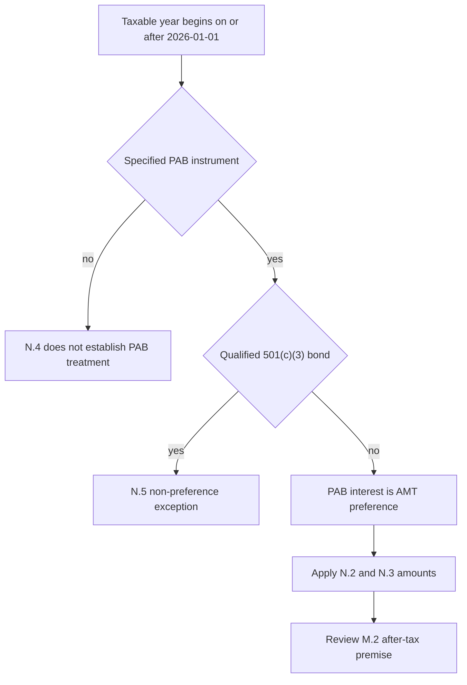

## Edition, applicability, and research conclusion

**FI-US-MUNI-CREDIT edition 2025-06** was published on 2025-06-12 and applies to positions taken on or after 2025-07-01. It moves US municipal credit from neutral to overweight: a two- to four-percentage-point increase within the taxable fixed-income sleeve, funded from investment-grade corporate credit and concentrated in high-yield and lower-investment-grade private-activity bonds (PABs). [Municipal Credit 2025-06, introduction and M.1](repo://research/FI/US/MUNI-CREDIT/2025-06.md#L12-L20)

This is research, not a portfolio instruction. The note is the basis of record for positions taken while it applies; frozen research is not edited in place, and a later edition would not rewrite the rationale for an earlier position. Binding targets, account scope, and implementation controls belong to the US Taxable Account Fixed Income Allocation Guide. [Research-corpus conventions](repo://README.md#L41-L48) [Allocation Guide, introduction and A.1](repo://guidelines/allocation/us-taxable-fixed-income.md#L1-L11)

## Load-bearing after-tax premise

The private-activity case is explicitly **“an after-tax case and not a spread case.”** On a pre-tax basis, PABs trade inside comparable corporate credit for most ratings; the advantage appears only after tax and only for holders in the top federal bracket. The note’s load-bearing assumption is that the AMT exemption and phase-out thresholds then in force leave most of that client base outside AMT. **If a reduced phase-out threshold draws a materially larger share into AMT, “the recommendation in M.1 does not survive it.”** [Municipal Credit 2025-06, M.2](repo://research/FI/US/MUNI-CREDIT/2025-06.md#L22-L30)

The research distinguishes the threshold from the PAB preference treatment itself: post-1986 specified PAB interest enters alternative minimum taxable income as an item of tax preference, which the desk described as long-settled. [Municipal Credit 2025-06, M.2](repo://research/FI/US/MUNI-CREDIT/2025-06.md#L24-L30)

### 2026 IRS threshold overlay

**IRS Revenue Procedure 2025-41 N.3 supersedes FI-US-MUNI-CREDIT 2025-06 M.2** as to the threshold-dependent after-tax premise for affected taxpayers in taxable years beginning on or after 2026-01-01. The procedure sets the phase-out threshold at $500,000 for an unmarried individual and $1,000,000 for married joint filers, reduces the exemption above those levels, and applies the specified-PAB treatment to a taxpayer above the applicable threshold regardless of prior thresholds. This is the threshold change M.2 names as invalidating its recommendation; the procedure does not supply a replacement municipal recommendation or portfolio weight. [Revenue Procedure 2025-41, N.3](repo://bulletins/IRS/2025-08-rev-proc-2025-41-amt-thresholds.md#L18-L22) [Municipal Credit 2025-06, M.2](repo://research/FI/US/MUNI-CREDIT/2025-06.md#L22-L30)

The procedure retains the PAB rule: interest on a specified PAB remains an **“item of tax preference”** and is included in alternative minimum taxable income. It defines the relevant bond as a section 141 PAB issued after 1986-08-07 whose interest is excluded under section 103. [Revenue Procedure 2025-41, N.4](repo://bulletins/IRS/2025-08-rev-proc-2025-41-amt-thresholds.md#L24-L28)

**IRS Revenue Procedure 2025-41 N.5 preserves** the qualified-501(c)(3) exception: interest on a qualified section 145 bond is not an item of tax preference, and nothing in the new exemption or phase-out amounts applies to it. The note says nonprofit hospitals and private higher education are predominantly qualified 501(c)(3) bonds, while airport special-facility paper predominantly is not; determine qualification instrument by instrument rather than from a sector label. This limited exception does not restore M.2’s after-tax rationale for non-excepted instruments or affected taxpayers. [Revenue Procedure 2025-41, N.5](repo://bulletins/IRS/2025-08-rev-proc-2025-41-amt-thresholds.md#L30-L34) [Municipal Credit 2025-06, M.5](repo://research/FI/US/MUNI-CREDIT/2025-06.md#L44-L50)

This flow shows the procedure’s tax-year, instrument, and exception boundaries; it is not an account-level AMT calculation.

## Independent support and research expression

Credit fundamentals are independent but insufficient support for the full M.1 position: growing state and local tax receipts, high rainy-day balances, and stronger municipal default and recovery experience support only a neutral to modest overweight. Supply is a separate technical: issuance has been below its ten-year average, and the desk expects negative net PAB supply through 2027. [Municipal Credit 2025-06, M.3–M.4](repo://research/FI/US/MUNI-CREDIT/2025-06.md#L32-L42)

Within PABs, the preference order is nonprofit hospital systems meeting the stated pricing-power and operating-margin screen, private higher education with endowment coverage above four times annual operating expense, and large-hub airport special-facility paper with signatory carrier agreements beyond 2035. The note underweights standalone senior living, single-asset student housing, and single-obligor industrial-development paper regardless of rating. [Municipal Credit 2025-06, M.5](repo://research/FI/US/MUNI-CREDIT/2025-06.md#L44-L50)

The research expression is the eight-to-fifteen-year curve sector. It does not recommend extending duration beyond 15 years at current ratios or using the front end, where the after-tax advantage is smallest and least durable. [Municipal Credit 2025-06, M.6](repo://research/FI/US/MUNI-CREDIT/2025-06.md#L52-L54)

## Binding implementation and review path

For top-federal-bracket clients, the Allocation Guide sets a **22%** municipal target against **18%** neutral; it adopts the four-point overweight and PAB concentration from M.1/M.2. Below the top bracket, municipal credit remains at the 18% neutral weight and the PAB concentration does not apply. The guide makes the note’s sector preferences binding as limits: a preferred sector is capped at 35% of the municipal allocation, an underweight sector needs approval, and duration beyond 15 years needs approval and cannot be granted portfolio-wide. [Allocation Guide, A.3–A.4](repo://guidelines/allocation/us-taxable-fixed-income.md#L17-L31)

The paired funding control sets investment-grade corporate credit at 28% against a 32% neutral weight. If the guide-derived municipal overweight is suspended because a cited note is superseded or withdrawn, the corporate underweight is suspended with it and both return to neutral; a suspension is not ordinary month-end drift and must not be mechanically rebalanced. [Allocation Guide, A.1 and A.5–A.6](repo://guidelines/allocation/us-taxable-fixed-income.md#L7-L11) [Allocation Guide, A.5–A.6](repo://guidelines/allocation/us-taxable-fixed-income.md#L33-L43)

M.7 identifies a reduced AMT phase-out threshold as the risk that invalidates M.2; M.8 requires immediate review and re-issue after an announced change to the M.2 tax treatment. That required research action is distinct from the guide’s stated superseded-or-withdrawn suspension trigger. On such a suspension, the manager escalates to the Committee and may neither carry the old weight forward nor turn replacement research into a binding weight. [Municipal Credit 2025-06, M.7–M.8](repo://research/FI/US/MUNI-CREDIT/2025-06.md#L56-L70) [Allocation Guide, A.1](repo://guidelines/allocation/us-taxable-fixed-income.md#L7-L11) [Discretion Matrix, D.4](repo://guidelines/authority/discretion-matrix.md#L31-L37)

See the [IRS private-activity-bond AMT overlay](/openwiki/regulatory/irs-private-activity-bond-amt.md) for the regulatory boundary, [taxable fixed-income allocation guidance](/openwiki/guidance/allocation/taxable-fixed-income.md) for binding controls, and [investment-grade spreads](/openwiki/research/fixed-income/investment-grade-spreads.md) for the paired funding position.
