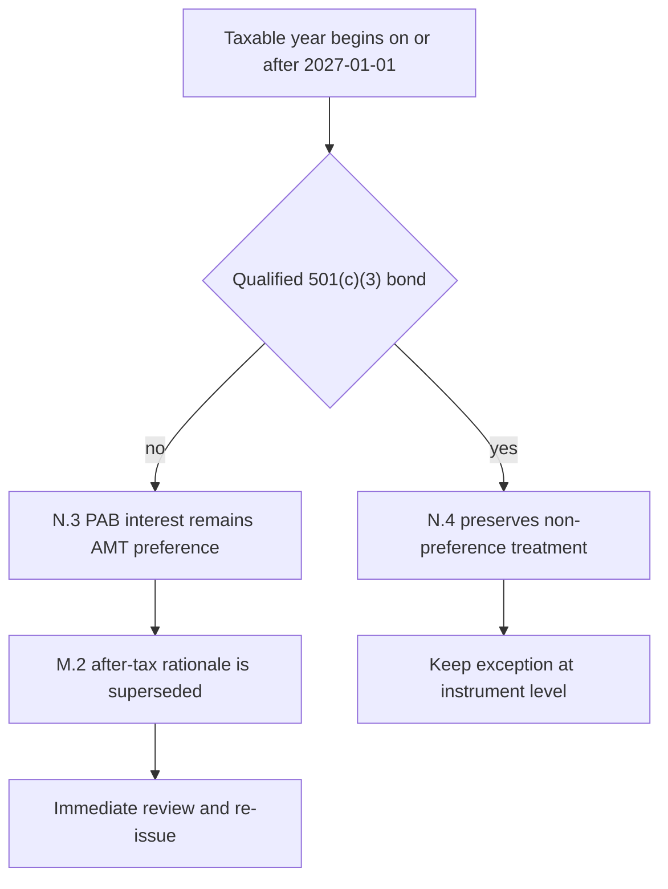

## Edition, scope, and conclusion

**FI-US-MUNI-CREDIT edition 2025-11**, published 2025-11-14 and applicable to positions taken on or after 2025-12-01, moves US municipal credit from neutral to overweight. Its recommended expression is a **two- to four-percentage-point** increase within the taxable fixed-income sleeve, funded from investment-grade corporate credit, and concentrated in high-yield and lower-investment-grade private-activity bonds (PABs). [Municipal Credit 2025-11, M.1](repo://research/FI/US/MUNI-CREDIT/2025-11.md#L1-L9)

This is specifically a top-federal-bracket after-tax view, not a general credit call. The binding allocation guide separately adopts a 22% municipal target against 18% neutral for top-bracket clients and the PAB concentration from **FI-US-MUNI-CREDIT edition 2025-11 M.1/M.2**; below the top bracket it sets the municipal weight at the 18% neutral and does not apply that concentration. The guide, rather than research, owns those portfolio weights. [Allocation Guide, A.1 and A.3](repo://guidelines/allocation/us-taxable-fixed-income.md#L7-L11) [Allocation Guide, A.3](repo://guidelines/allocation/us-taxable-fixed-income.md#L17-L23)

## Load-bearing AMT premise and the bounded IRS overlay

**FI-US-MUNI-CREDIT edition 2025-11 M.2** says, in material part, that the PAB case is “an after-tax case and not a spread case”; pre-tax PAB paper trades inside comparable corporates for most ratings. Its load-bearing assumption was that then-indexed AMT exemption and phase-out amounts left the large majority of the top-bracket client base outside AMT, so the post-1986 PAB preference did not produce tax liability. The note is explicit: if lower thresholds, or a changed treatment, draw a materially larger share of those holders into AMT, “the recommendation in M.1 does not survive it.” [Municipal Credit 2025-11, M.2](repo://research/FI/US/MUNI-CREDIT/2025-11.md#L11-L17)

**IRS Notice 2026-18 N.3 supersedes the FI-US-MUNI-CREDIT edition 2025-11 M.2 rationale**, directionally and only as to the affected private-activity after-tax premise. For taxable years beginning on or after 2027-01-01, N.2 reduces the AMT exemption to $85,700 for married joint filers and $55,100 for unmarried filers, with phase-out thresholds of $500,000 and $300,000. N.3 retains the statutory preference for post-1986 qualified PAB interest other than qualified 501(c)(3) bonds, but says the lower thresholds change the taxpayer population for whom that preference produces actual AMT liability. That is the threshold event M.2 named; it does not turn the notice into a replacement municipal recommendation or a new portfolio weight. [IRS Notice 2026-18, N.2–N.3](repo://bulletins/IRS/2026-03-amt-private-activity-bond-interest.md#L9-L21) [Municipal Credit 2025-11, M.2](repo://research/FI/US/MUNI-CREDIT/2025-11.md#L11-L17)

Separately and directionally, **IRS Notice 2026-18 N.4 preserves qualified 501(c)(3) treatment**: such interest “is not an item of tax preference” and is unaffected by the notice. This preserves the instrument-level exception; it does not restore the M.2 PAB rationale for non-501(c)(3) obligations or affected taxpayers. N.3 supplies the affected PAB rule and N.4 its qualified-501(c)(3) boundary, while M.2 states the rationale that N.3 supersedes. [IRS Notice 2026-18, N.3–N.4](repo://bulletins/IRS/2026-03-amt-private-activity-bond-interest.md#L17-L25) [Municipal Credit 2025-11, M.2](repo://research/FI/US/MUNI-CREDIT/2025-11.md#L11-L17)

The effective-date test follows the holder’s taxable year and interest receipt, not acquisition date: N.5 applies N.3 treatment to interest received in a taxable year beginning on or after 2027-01-01 “regardless of when the obligation was acquired.” [IRS Notice 2026-18, N.5](repo://bulletins/IRS/2026-03-amt-private-activity-bond-interest.md#L29-L31)

This flow distinguishes N.3’s invalidated private-activity rationale from N.4’s preserved qualified-501(c)(3) exception.

## Credit, supply, sector, and duration expression

The Notice does **not** change the research conclusion except through the stated M.2 assumption. In **FI-US-MUNI-CREDIT edition 2025-11**, fundamentals—tax-receipt growth, high rainy-day balances, and historically stronger municipal default and recovery experience—support only a neutral to modest overweight by themselves. Constrained private-activity supply through 2027 is an independent technical support. Neither independently supports the size of M.1’s overweight. [Municipal Credit 2025-11, M.3–M.4](repo://research/FI/US/MUNI-CREDIT/2025-11.md#L19-L29)

For **FI-US-MUNI-CREDIT edition 2025-11**, the PAB preference order is nonprofit hospital systems meeting the stated pricing-power and operating-margin screen, private higher education with endowment coverage above four times annual operating expense, then large-hub airport special-facility paper with signatory carrier agreements beyond 2035. The note underweights standalone senior living, single-asset student housing, and single-obligor industrial-development paper regardless of rating. N.4’s preserved treatment is particularly relevant to qualifying hospital and private-higher-education bonds, but qualification must be determined for the instrument rather than assumed from sector. [Municipal Credit 2025-11, M.5](repo://research/FI/US/MUNI-CREDIT/2025-11.md#L31-L35) [IRS Notice 2026-18, N.4](repo://bulletins/IRS/2026-03-amt-private-activity-bond-interest.md#L23-L27)

For **FI-US-MUNI-CREDIT edition 2025-11**, express the overweight in the **8–15-year** curve sector; do not extend beyond 15 years at current ratios or use the front end, where the after-tax advantage is smallest and least durable. The allocation guide makes the preferred-sector limits binding: no more than 35% of the municipal allocation in any one preferred sector, approval for the underweight sectors, and approval for extensions beyond 15 years. [Municipal Credit 2025-11, M.6](repo://research/FI/US/MUNI-CREDIT/2025-11.md#L37-L39) [Allocation Guide, A.4](repo://guidelines/allocation/us-taxable-fixed-income.md#L25-L31)

## Review and control boundary

**FI-US-MUNI-CREDIT edition 2025-11 M.7–M.8** ranks a change to PAB tax treatment, AMT exemption, or phase-out thresholds as the risk that invalidates M.2 and the recommendation, and requires immediate review and re-issue upon an announced change to the M.2 treatment. This preserves the historical edition as the basis of record for positions taken while it was applicable; it does not authorize a manager to select a successor conclusion. [Municipal Credit 2025-11, M.7–M.8](repo://research/FI/US/MUNI-CREDIT/2025-11.md#L41-L55) [Research-corpus convention](repo://README.md#L30-L39)

The operational consequence belongs to the allocation and escalation controls, not to the IRS notice. If cited research is superseded or withdrawn, the allocation guide suspends the derived weight pending Committee re-adoption; the paired four-point IG-corporate underweight is suspended with the municipal overweight and both return to neutral. A suspension is not ordinary ±2-point month-end drift and cannot be mechanically rebalanced. The manager must escalate and cannot carry forward or directly adopt replacement research as a binding weight. [Allocation Guide, A.1 and A.5–A.6](repo://guidelines/allocation/us-taxable-fixed-income.md#L7-L11) [Allocation Guide, A.5–A.6](repo://guidelines/allocation/us-taxable-fixed-income.md#L33-L43) [Discretion Matrix, D.4](repo://guidelines/authority/discretion-matrix.md#L31-L37)

See the [IRS private-activity-bond AMT overlay](/openwiki/regulatory/irs-private-activity-bond-amt.md) for the regulatory boundary, [taxable fixed-income allocation guidance](/openwiki/guidance/allocation/taxable-fixed-income.md) for binding controls, and [investment-grade spreads](/openwiki/research/fixed-income/investment-grade-spreads.md) for the paired funding position.

## Source basis

- **Research view, load-bearing premise, fundamentals, supply, sectors, duration, risks, and review:** `research/FI/US/MUNI-CREDIT/2025-11.md`, M.1–M.8.
- **AMT thresholds, PAB preference, qualified-501(c)(3) exception, and transition:** `bulletins/IRS/2026-03-amt-private-activity-bond-interest.md`, N.2–N.5.
- **Binding weights, implementation limits, paired funding, and suspension mechanics:** `guidelines/allocation/us-taxable-fixed-income.md`, A.1 and A.3–A.6.
- **Escalation authority:** `guidelines/authority/discretion-matrix.md`, D.4.
