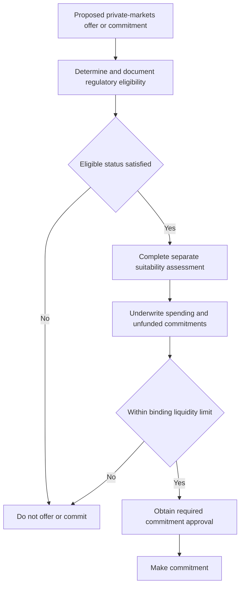

# Private Markets Allocation Framework

> **Research scope.** This page records the global Multi-Asset Research view, not client-specific investment advice, binding allocation guidance, an eligibility determination, a suitability assessment, or a commitment approval. The source note is a synthetic demonstration document. [Framework notice](repo://research/MA/GL/PRIVATE-MARKETS/2025-12.md#L1-L3) [Framework publication and scope](repo://research/MA/GL/PRIVATE-MARKETS/2025-12.md#L12-L14)

## Edition and applicability

**MA-GL-PRIVATE-MARKETS, edition 2025-12** was published by Multi-Asset Research on **2025-12-10**, takes a global view, and applies to positions taken on or after **2026-01-01**. [Framework publication and scope](repo://research/MA/GL/PRIVATE-MARKETS/2025-12.md#L12-L14)

## Strategic research view

For an eligible client with a genuine ten-year horizon, the desk supports a **10–20% strategic private-markets allocation**. It favors secondaries and private credit and recommends an underweight to primary buyout at current entry multiples. This is the research range and relative positioning; it is not itself a committee-adopted mandate weight or a commitment instruction. [Framework V.1](repo://research/MA/GL/PRIVATE-MARKETS/2025-12.md#L16-L18) [Global Multi-Asset Bands B.1–B.2](repo://guidelines/allocation/gl-multi-asset-bands.md#L7-L15)

### Preferred exposures

- **Secondaries — preferred entry point.** Buyout-portfolio discounts to net asset value have narrowed but remain wider than their ten-year median, which the desk cites for regarding secondaries as the most attractive entry point. [Framework V.3](repo://research/MA/GL/PRIVATE-MARKETS/2025-12.md#L24-L26)
- **Private credit — preferred, with a covenant-quality watchpoint.** The desk considers spreads over broadly syndicated loans adequate compensation for illiquidity, while noting deteriorating covenant quality at the larger end of the market where private credit competes with syndicated issuance. [Framework V.4](repo://research/MA/GL/PRIVATE-MARKETS/2025-12.md#L28-L30)
- **Primary buyout — underweight, not excluded.** Entry multiples remain above the desk’s fair-value estimate and the exit environment has not normalised; therefore the recommendation is to underweight primary buyout within the sleeve rather than avoid it. [Framework V.5](repo://research/MA/GL/PRIVATE-MARKETS/2025-12.md#L32-L34)

## Liquidity underwriting and pacing

Underwrite a private-markets allocation against the client’s **spending requirement**, not expected return. The research recommendation is that unfunded commitments not exceed **two years of liquid-portfolio spending**. [Framework V.6](repo://research/MA/GL/PRIVATE-MARKETS/2025-12.md#L36-L38)

For the global balanced mandate, the Investment Policy Committee’s separate guidance sets a 10% private-markets sleeve for eligible clients and makes the V.6 recommendation a **binding limit**. That guidance manages the sleeve through commitment pacing rather than ordinary rebalancing: a denominator-effect drift above the strategic weight is neither a breach nor traded, whereas drift from over-commitment is a pacing failure that must be escalated. These are implementation controls owned by allocation guidance, not changes to the research view. [Global Multi-Asset Bands B.2](repo://guidelines/allocation/gl-multi-asset-bands.md#L13-L15) [Global Multi-Asset Bands B.6](repo://guidelines/allocation/gl-multi-asset-bands.md#L31-L35)

The underlying failure modes explain the control design: a prolonged closure of the exit environment can extend duration in an asset class that cannot be rebalanced, and a drawdown can mechanically push allocation through an untradable band through denominator effects. [Framework V.7](repo://research/MA/GL/PRIVATE-MARKETS/2025-12.md#L40-L42)

## Independent gates before a commitment

**Eligibility is a regulatory constraint, not a research conclusion.** The research note assigns qualified-client and accredited-investor thresholds to the regulatory domain and applies its view only to clients who are eligible; the desk does not determine eligibility. [Framework V.2](repo://research/MA/GL/PRIVATE-MARKETS/2025-12.md#L20-L22)

Do not collapse eligibility, suitability, liquidity, and approval into one test. Eligibility determines whether a strategy may be offered and must be determined and documented before an offer; it is outside portfolio-manager discretion. Suitability remains a separate client-specific requirement, and the V.6 liquidity constraint must also be satisfied before commitment. Every private-markets commitment additionally requires approval, which cannot substitute for eligibility or clear a regulatory breach. [Eligibility Guide P.1](repo://guidelines/suitability/private-markets-eligibility.md#L7-L9) [Eligibility Guide P.6](repo://guidelines/suitability/private-markets-eligibility.md#L31-L35) [Discretion Matrix D.3 and D.5](repo://guidelines/authority/discretion-matrix.md#L17-L29) [Discretion Matrix D.5](repo://guidelines/authority/discretion-matrix.md#L39-L47)

This operating sequence shows the separate regulatory, client, liquidity, and authority decisions; research informs the proposed exposure but does not replace any gate. [Eligibility Guide P.1 and P.6](repo://guidelines/suitability/private-markets-eligibility.md#L7-L9) [Eligibility Guide P.6](repo://guidelines/suitability/private-markets-eligibility.md#L31-L35) [Discretion Matrix D.3](repo://guidelines/authority/discretion-matrix.md#L17-L29)

## Operating boundaries and related guidance

The research range must not be used to infer regulatory status, suitability, liquidity capacity, or approval. For the current qualified-client thresholds, effective-date treatment, and determination records, use the [SEC Qualified Client Threshold Overlay](/openwiki/regulatory/sec-qualified-purchaser.md). For the firm’s offer, documentation, suitability, and liquidity controls, use [Private Markets Client Eligibility and Suitability](/openwiki/guidance/suitability/private-markets-eligibility.md); for the committee-owned 10% sleeve and pacing treatment, use [Internal Guidance: Global Multi-Asset Bands](/openwiki/guidance/allocation/global-multi-asset-bands.md). The qualified-purchaser definition is separate from the qualified-client and accredited-investor standards and is not adjusted by SEC Order IA-7104. [Order IA-7104 Q.6](repo://bulletins/SEC/2026-04-order-ia-7104-qualified-client.md#L34-L36) [Eligibility Guide P.4](repo://guidelines/suitability/private-markets-eligibility.md#L23-L25)
