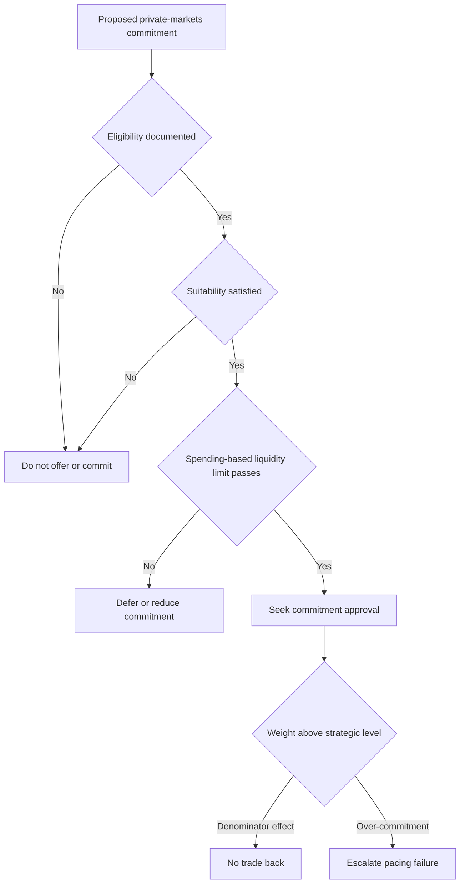

## Scope and status

> **Demonstration-corpus status:** MA-GL-PRIVATE-MARKETS 2025-12 is explicitly synthetic: its figures are invented, and it is not research, a recommendation, or investment advice. [Source notice](repo://internal_research/MA/GL/PRIVATE-MARKETS/2025-12.md#L1-L3)

Multi-Asset Research published this global initiation on 10 December 2025 for positions taken on or after 1 January 2026. Its stated recommendation is **“Ten to twenty percent strategic allocation for eligible clients who actually have a ten-year horizon.”** This is a conditional research view, not a standing mandate weight and not a conclusion that an individual client may be offered a strategy. [Publication and summary view](repo://internal_research/MA/GL/PRIVATE-MARKETS/2025-12.md#L7-L18)

The research note treats eligibility as a constraint, not a view: qualified-client and accredited-investor thresholds are regulatory matters, and the desk’s view applies only after the client is eligible. [Research eligibility boundary](repo://internal_research/MA/GL/PRIVATE-MARKETS/2025-12.md#L20-L22)

## Research preference within a private-markets sleeve

Within any private-markets allocation, the note weights toward **secondaries** and **private credit** and recommends **underweighting primary buyout**, rather than avoiding the asset class. This is a relative sleeve mix; it neither sets the portfolio’s binding weight nor substitutes for a client gate. [Research summary](repo://internal_research/MA/GL/PRIVATE-MARKETS/2025-12.md#L12-L18) [Primary buyout](repo://internal_research/MA/GL/PRIVATE-MARKETS/2025-12.md#L32-L34)

- **Secondaries:** Discounts to net asset value have narrowed but remain wide of the ten-year median for buyout portfolios; the desk identifies secondaries as the most attractive entry point in the complex. [Secondaries](repo://internal_research/MA/GL/PRIVATE-MARKETS/2025-12.md#L24-L26)
- **Private credit:** The desk considers spreads over broadly syndicated loans adequate compensation for illiquidity, while monitoring deteriorated covenant quality at the larger end of the market that competes with syndicated issuance. [Private credit](repo://internal_research/MA/GL/PRIVATE-MARKETS/2025-12.md#L28-L30)
- **Primary buyout:** Entry multiples remain above the desk’s estimate of fair value and exits have not normalised; the prescribed positioning is underweight within the sleeve. [Primary buyout](repo://internal_research/MA/GL/PRIVATE-MARKETS/2025-12.md#L32-L34)

## Horizon and liquidity condition of the view

The ten-year horizon and liquidity condition are part of the research view. Underwrite against the client’s **spending requirement**, not the allocation’s expected return. The note recommends that **“no client hold a private markets allocation whose unfunded commitments exceed two years of liquid portfolio spending.”** [Liquidity view](repo://internal_research/MA/GL/PRIVATE-MARKETS/2025-12.md#L36-L38)

The note also identifies two implementation risks: prolonged exit-market closure extends duration in an allocation that cannot be rebalanced, and drawdowns can create denominator effects that mechanically move the reported weight above an allocation band. [Research risks](repo://internal_research/MA/GL/PRIVATE-MARKETS/2025-12.md#L40-L42)

## Interacting controls are not the research conclusion

**The allocation guide** sets the binding strategic default for a global balanced mandate: 10% private markets for eligible clients, with the sleeve reallocated pro rata across liquid sleeves for ineligible clients. It makes the research note’s V.6 liquidity constraint binding as a limit. The guide manages private markets through commitment pacing, not an ordinary trading tolerance band: denominator-driven drift is neither a breach nor a trade instruction, while drift from over-commitment is a pacing failure escalated under D.4. [Allocation guide B.1–B.3](repo://internal_guidelines/allocation/gl-multi-asset-bands.md#L7-L19) [Allocation guide B.6](repo://internal_guidelines/allocation/gl-multi-asset-bands.md#L31-L35)

**The eligibility guide** implements the regulatory eligibility gate. It requires eligibility to be determined and documented before a private-markets strategy is offered; eligibility is outside portfolio-manager discretion. It also requires separate accredited-investor determination and a separate suitability assessment before commitment. [Eligibility guide P.1 and P.4–P.6](repo://internal_guidelines/suitability/private-markets-eligibility.md#L7-L9) [Eligibility guide P.4–P.6](repo://internal_guidelines/suitability/private-markets-eligibility.md#L23-L35)

**SEC Order IA-7104** adjusts Rule 205-3 dollar tests only; it does not adjust accredited-investor or qualified-purchaser standards. For entries on or after 29 June 2026, it states alternative qualified-client tests of at least $1,400,000 under the adviser’s management immediately after contract entry or the adviser’s reasonable belief immediately before entry that net worth is more than $2,700,000. A pre-effective-date determination remains tied to its original entry and cannot be used for a new entry on or after that date. [Order Q.2](repo://external_sources/SEC/2026-04-order-ia-7104-qualified-client.md#L14-L18) [Order Q.4](repo://external_sources/SEC/2026-04-order-ia-7104-qualified-client.md#L24-L28) [Order Q.6](repo://external_sources/SEC/2026-04-order-ia-7104-qualified-client.md#L34-L36)

**The discretion matrix** requires approval for every private-markets commitment, but positions the eligibility determination before approval and does not permit approval to clear ineligibility or a regulatory breach. [Discretion matrix D.3 and D.5](repo://internal_guidelines/authority/discretion-matrix.md#L17-L29) [Discretion matrix D.5](repo://internal_guidelines/authority/discretion-matrix.md#L39-L47)

This control sequence shows the firm controls surrounding, rather than derived from, the research view: eligibility, suitability, and the binding liquidity limit precede commitment approval; pacing governs the post-commitment response. [Eligibility guide P.1 and P.6](repo://internal_guidelines/suitability/private-markets-eligibility.md#L7-L9) [Eligibility guide P.6](repo://internal_guidelines/suitability/private-markets-eligibility.md#L31-L35) [Allocation guide B.6](repo://internal_guidelines/allocation/gl-multi-asset-bands.md#L31-L35) [Discretion matrix D.3](repo://internal_guidelines/authority/discretion-matrix.md#L17-L29)

## Responsibilities and operating boundary

Use the research note to assess the conditional 10–20% view, the genuine ten-year horizon, the preferred sleeve mix, and the spending-based liquidity underwriting. Use the allocation guide for mandate weights and pacing. Use the eligibility guide and applicable order for regulatory status and records. Use the discretion matrix for commitment approval and escalation authority. A research conclusion does not satisfy eligibility, suitability, liquidity, or approval requirements; equally, a client who passes those controls is not thereby the subject of a research recommendation.

If a research note supporting an allocation band is superseded or withdrawn, **the allocation guide** suspends that band and returns it to the prior committee-adopted level pending review. **The discretion matrix** then requires escalation to the committee rather than a manager carrying forward, re-deriving, or directly adopting a replacement research recommendation. [Allocation guide B.1 and B.7](repo://internal_guidelines/allocation/gl-multi-asset-bands.md#L7-L11) [Allocation guide B.7](repo://internal_guidelines/allocation/gl-multi-asset-bands.md#L37-L39) [Discretion matrix D.4](repo://internal_guidelines/authority/discretion-matrix.md#L31-L37)
