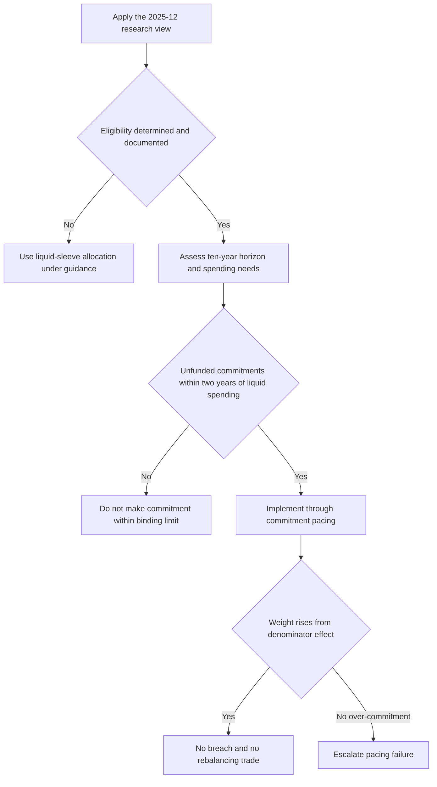

# Private Markets Framework: View, Liquidity Limit, and Eligibility Boundary

## Scope and edition

This page records the **Multi-Asset Research** view in *Private Markets Allocation Framework*, edition **2025-12**. Published 2025-12-10, the note applies to positions taken on or after 2026-01-01 and takes a global view. It is an initiation, not a client recommendation or an eligibility determination. The view is therefore an input to a later client decision, not authority to offer, approve, or commit capital. [Framework, introduction and V.1–V.2](repo://internal_research/MA/GL/PRIVATE-MARKETS/2025-12.md#L1-L22)

## Research view

For **eligible clients who actually have a ten-year horizon**, edition 2025-12 recommends a **10–20% strategic private-markets allocation**. Within that allocation, it is weighted to secondaries and private credit and away from primary buyout. [Framework, V.1](repo://internal_research/MA/GL/PRIVATE-MARKETS/2025-12.md#L16-L18)

The sub-asset preferences are specific to the note's current-entry assessment:

- **Secondaries:** discounts to NAV had narrowed but remained wide of the ten-year median for buyout portfolios; the desk regarded secondaries as the most attractive entry point in the private-markets complex. [Framework, V.3](repo://internal_research/MA/GL/PRIVATE-MARKETS/2025-12.md#L24-L26)
- **Private credit:** spreads over broadly syndicated loans were viewed as adequate illiquidity compensation. The desk was monitoring deteriorating covenant quality at the larger end of the market, where private credit competes directly with syndicated issuance. [Framework, V.4](repo://internal_research/MA/GL/PRIVATE-MARKETS/2025-12.md#L28-L30)
- **Primary buyout:** entry multiples remained above the desk's fair-value estimate and the exit environment had not normalised. The implication is an underweight *within* private markets, not avoidance of the asset class. [Framework, V.5](repo://internal_research/MA/GL/PRIVATE-MARKETS/2025-12.md#L32-L34)

## Liquidity and implementation boundary

The research underwriting test is client spending, not expected return: the note recommends that unfunded commitments do not exceed **two years of liquid portfolio spending**. This is especially important because private markets cannot be rebalanced readily; the note identifies a prolonged closure of the exit environment and drawdown-driven denominator effects as the principal implementation risks. [Framework, V.6–V.7](repo://internal_research/MA/GL/PRIVATE-MARKETS/2025-12.md#L36-L42)

The research note recommends that limit, whereas the allocation guide makes it binding. **Global Multi-Asset Allocation Bands B.6 constrains Framework V.6** by subjecting unfunded commitments to its binding liquidity constraint. It also requires commitment pacing rather than ordinary rebalancing: denominator-driven drift above the strategic weight is neither a breach nor a trade, while drift caused by over-commitment is a pacing failure requiring escalation. [Global Multi-Asset Allocation Bands, B.6](repo://internal_guidelines/allocation/gl-multi-asset-bands.md#L31-L35) [Framework, V.6–V.7](repo://internal_research/MA/GL/PRIVATE-MARKETS/2025-12.md#L36-L42)

The guide's 10% private-markets strategic weight for global balanced mandates is a separate committee-adopted default, not a conversion of the research range into binding guidance. It applies only to eligible clients; for an ineligible client, the guide reallocates that weight pro rata across liquid sleeves. [Global Multi-Asset Allocation Bands, B.1–B.3](repo://internal_guidelines/allocation/gl-multi-asset-bands.md#L7-L19)

*The implementation sequence keeps the research view, eligibility gate, suitability work, binding liquidity limit, and pacing response distinct.*

## Eligibility is not suitability, and neither is the research view

The research view applies only after regulatory eligibility is established; it does not determine qualified-client or accredited-investor status. The **Private Markets Client Eligibility Determination Guide P.2 implements SEC Order IA-7104 Q.2** for qualified-client determinations, while P.4 requires accredited-investor status to be determined separately. The order adjusts Rule 205-3 dollar tests only and leaves accredited-investor and qualified-purchaser standards to their own terms. [Eligibility Guide, P.2 and P.4](repo://internal_guidelines/suitability/private-markets-eligibility.md#L11-L25) [SEC Order IA-7104, Q.2 and Q.6](repo://external_sources/SEC/2026-04-order-ia-7104-qualified-client.md#L14-L18) [SEC Order IA-7104, Q.6](repo://external_sources/SEC/2026-04-order-ia-7104-qualified-client.md#L34-L36)

Eligibility is necessary but insufficient: no private-markets strategy may be offered until eligibility is determined and documented, it is outside portfolio-manager discretion, and an eligible client must still meet suitability and the V.6 liquidity constraint before commitment. A file that records eligibility but omits suitability is incomplete. [Eligibility Guide, P.1 and P.6](repo://internal_guidelines/suitability/private-markets-eligibility.md#L7-L10) [Eligibility Guide, P.6](repo://internal_guidelines/suitability/private-markets-eligibility.md#L31-L35)

For determinations on or after 2026-06-29, the order's qualified-client pathways are at least $1,400,000 under management immediately after entering the advisory contract, or adviser-reasonably-believed net worth above $2,700,000 immediately before entry. A properly made pre-effective-date determination is preserved only for its existing contract or investment and cannot be reused for a new entry on or after that date. The adviser must retain records of the determination's basis, test, and date; the internal guide additionally requires the pathway, evidence, decision maker, and date, treating an undocumented basis as no determination in audit. [SEC Order IA-7104, Q.2 and Q.4–Q.5](repo://external_sources/SEC/2026-04-order-ia-7104-qualified-client.md#L14-L18) [SEC Order IA-7104, Q.4–Q.5](repo://external_sources/SEC/2026-04-order-ia-7104-qualified-client.md#L24-L32) [Eligibility Guide, P.5](repo://internal_guidelines/suitability/private-markets-eligibility.md#L27-L29)

## Practical reading order

1. Use edition 2025-12 for its global view: 10–20% for an eligible client with a real ten-year horizon, tilted to secondaries and private credit and underweight primary buyout.
2. Treat the spending-based unfunded-commitment test as a pre-commitment constraint, not as a return forecast; follow the allocation guide's binding limit and pacing treatment.
3. Obtain the eligibility determination from Compliance's separate process. Do not infer it from the research view, a proposed allocation, or another eligibility label.
4. Complete the separate suitability assessment—including horizon and liquidity—before commitment. Binding allocation guidance and regulatory eligibility control what may be implemented; neither changes the research conclusion.

## Source basis

- [Private Markets Allocation Framework, edition 2025-12](repo://internal_research/MA/GL/PRIVATE-MARKETS/2025-12.md#L1-L44)
- [Global Multi-Asset Allocation Bands](repo://internal_guidelines/allocation/gl-multi-asset-bands.md#L7-L39)
- [Private Markets Client Eligibility Determination Guide](repo://internal_guidelines/suitability/private-markets-eligibility.md#L7-L35)
- [SEC Order IA-7104](repo://external_sources/SEC/2026-04-order-ia-7104-qualified-client.md#L8-L36)
