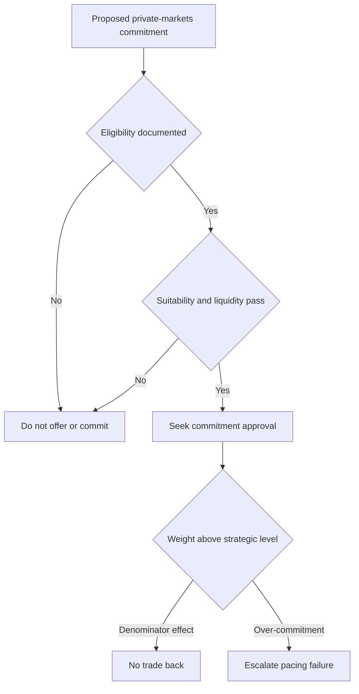

## Scope and status

> **Demonstration-corpus status:** MA-GL-PRIVATE-MARKETS 2025-12 is explicitly synthetic: its figures are invented, and it is not research, a recommendation, or investment advice. [Source notice](repo://internal_research/MA/GL/PRIVATE-MARKETS/2025-12.md#L1-L3)

This global initiation was published by Multi-Asset Research on 10 December 2025 and applies to positions taken on or after 1 January 2026. Its view is conditional: it supports a **10–20% strategic allocation** to private markets only for clients who are already eligible and have a genuine ten-year horizon. It is not a standing mandate weight or a decision that a particular client may be offered a strategy. [Publication and summary view](repo://internal_research/MA/GL/PRIVATE-MARKETS/2025-12.md#L7-L18)

The standing Investment Policy Committee default for a global balanced mandate is instead 10% private markets for eligible clients. For a client who is not eligible, the 10% sleeve is reallocated pro rata across liquid sleeves. Thus, the research range informs the view; it does not override the committee-owned allocation rule. [Allocation guide B.1–B.2](repo://internal_guidelines/allocation/gl-multi-asset-bands.md#L7-L16)

## Preferred exposures within the sleeve

The note favors **secondaries** and **private credit**, while keeping **primary buyout underweight rather than excluding it**. This is a relative mix inside any private-markets allocation, not a substitute for the client gates or commitment approval. [Research summary and V.5](repo://internal_research/MA/GL/PRIVATE-MARKETS/2025-12.md#L12-L18) [Primary buyout](repo://internal_research/MA/GL/PRIVATE-MARKETS/2025-12.md#L32-L34)

- **Secondaries — favored entry point.** Secondary discounts to NAV have narrowed but remain wide versus the ten-year median for buyout portfolios; the desk identifies this as the most attractive entry point in private markets. [Secondaries](repo://internal_research/MA/GL/PRIVATE-MARKETS/2025-12.md#L24-L26)
- **Private credit — favored with underwriting vigilance.** In the desk’s view, spreads over broadly syndicated loans adequately compensate for illiquidity. Covenant quality has deteriorated at the larger end of the market, where private credit competes directly with syndicated issuance, so that condition remains an underwriting watchpoint. [Private credit](repo://internal_research/MA/GL/PRIVATE-MARKETS/2025-12.md#L28-L30)
- **Primary buyout — underweight.** Entry multiples remain above the desk’s estimate of fair value and exits have not normalized. The prescribed response is an underweight within the sleeve, not wholesale avoidance. [Primary buyout](repo://internal_research/MA/GL/PRIVATE-MARKETS/2025-12.md#L32-L34)

## Research liquidity underwriting

Liquidity is a condition of this view, not an expected-return forecast. Underwrite the allocation against the client’s **spending requirement**, not the allocation’s expected return. The note recommends that unfunded commitments not exceed **two years of liquid-portfolio spending**; allocation guidance makes that V.6 constraint a binding limit. [Liquidity view](repo://internal_research/MA/GL/PRIVATE-MARKETS/2025-12.md#L36-L38) [Allocation guide B.6](repo://internal_guidelines/allocation/gl-multi-asset-bands.md#L31-L35)

Keep that underwriting distinct from **commitment pacing**. Private markets has no ordinary tolerance band because it cannot be traded like liquid sleeves. A rise above the strategic weight caused by a denominator effect is neither a breach nor a trade instruction. A rise caused by over-commitment is a pacing failure and is escalated under the D.4 process. The research specifically identifies prolonged exit-market closure and drawdown-driven denominator effects as the relevant risks. [Allocation guide B.3 and B.6](repo://internal_guidelines/allocation/gl-multi-asset-bands.md#L17-L19) [Allocation guide B.6](repo://internal_guidelines/allocation/gl-multi-asset-bands.md#L31-L35) [Research risks](repo://internal_research/MA/GL/PRIVATE-MARKETS/2025-12.md#L40-L42)

This control flow separates the pre-commitment regulatory and suitability gates from post-commitment pacing responses. [Eligibility guide P.1 and P.6](repo://internal_guidelines/suitability/private-markets-eligibility.md#L7-L9) [Eligibility guide P.6](repo://internal_guidelines/suitability/private-markets-eligibility.md#L31-L35) [Allocation guide B.6](repo://internal_guidelines/allocation/gl-multi-asset-bands.md#L31-L35) [Discretion matrix D.3](repo://internal_guidelines/authority/discretion-matrix.md#L17-L29)

## Eligibility, suitability, and approval are separate gates

The note treats qualified-client and accredited-investor status as **constraints**, not research conclusions. Before a private-markets strategy may be offered, eligibility must be determined and documented; it is a regulatory determination outside portfolio-manager discretion. Accredited-investor status is determined separately from qualified-client status, and an eligible client must still meet suitability and the spending-based liquidity limit before commitment. [Research eligibility boundary](repo://internal_research/MA/GL/PRIVATE-MARKETS/2025-12.md#L20-L22) [Eligibility guide P.1](repo://internal_guidelines/suitability/private-markets-eligibility.md#L7-L9) [Eligibility guide P.4–P.6](repo://internal_guidelines/suitability/private-markets-eligibility.md#L23-L35)

For a current entry on or after 29 June 2026, the synthetic SEC order supplies the qualified-client alternatives: at least $1,400,000 under the adviser’s management immediately after contract entry, or the adviser’s reasonable belief immediately before entry that net worth is more than $2,700,000. The order adjusts Rule 205-3 only; it does not adjust accredited-investor or qualified-purchaser standards. A pre-effective-date determination is preserved only for its original entry and cannot support a new entry on or after that date. These are regulatory-operating facts, not an allocation signal. [Order Q.2](repo://external_sources/SEC/2026-04-order-ia-7104-qualified-client.md#L14-L18) [Order Q.4](repo://external_sources/SEC/2026-04-order-ia-7104-qualified-client.md#L24-L28) [Order Q.6](repo://external_sources/SEC/2026-04-order-ia-7104-qualified-client.md#L34-L36)

The determination record must identify the pathway, supporting evidence, decision maker, and date; without a recorded basis, audit treats the determination as absent. A private-markets commitment also requires approval regardless of size, but approval cannot clear an ineligible client or another regulatory breach. [Eligibility guide P.5](repo://internal_guidelines/suitability/private-markets-eligibility.md#L27-L29) [Discretion matrix D.3 and D.5](repo://internal_guidelines/authority/discretion-matrix.md#L17-L29) [Discretion matrix D.5](repo://internal_guidelines/authority/discretion-matrix.md#L39-L47)

## Lifecycle and ownership boundaries

Use the research note to shape the preferred sleeve mix and test its genuine-horizon and spending-based liquidity conditions. Use allocation guidance for the binding mandate default, the no-trade response to denominator effects, and pacing escalation. Use the eligibility guidance and applicable order for the legal/compliance determination, and the discretion matrix for approval authority. No later approval or research conclusion cures a failed earlier eligibility, suitability, or liquidity gate.

If research supporting an allocation band is superseded or withdrawn, allocation guidance suspends that band and returns it to the prior committee-adopted level pending review. The manager must escalate rather than carry forward, re-derive, or directly adopt a replacement research recommendation; adoption of a binding weight is a committee act. [Allocation guide B.1 and B.7](repo://internal_guidelines/allocation/gl-multi-asset-bands.md#L7-L11) [Allocation guide B.7](repo://internal_guidelines/allocation/gl-multi-asset-bands.md#L37-L39) [Discretion matrix D.4](repo://internal_guidelines/authority/discretion-matrix.md#L31-L37)
