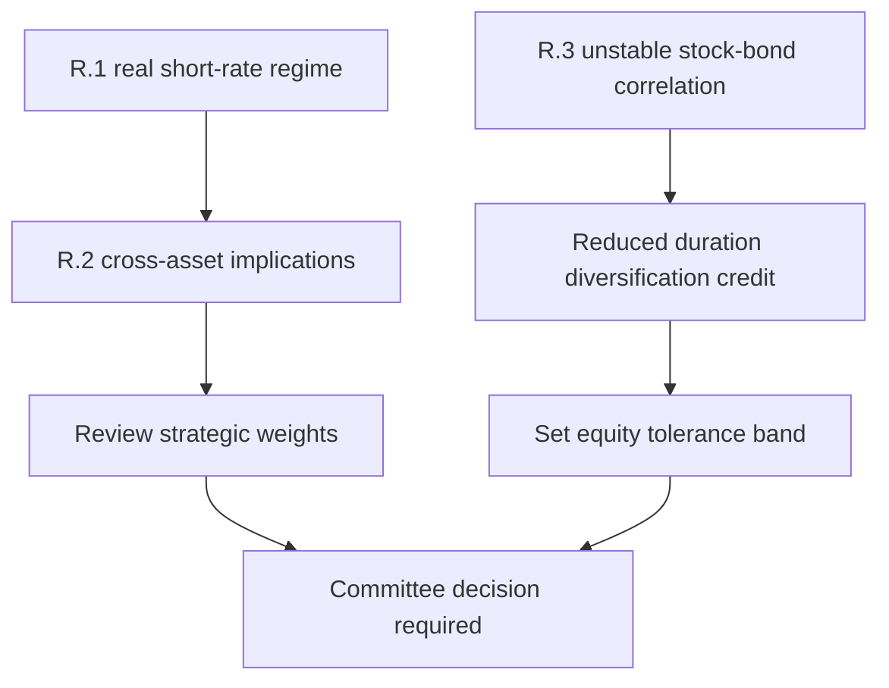

## Scope, edition, and ownership

> **Demonstration-corpus status:** the underlying note is explicitly synthetic; its figures are invented and it is not research, a recommendation, or investment advice. [Source notice](repo://research/MA/GL/RATES-REGIME/2026-02.md#L1-L3)

This page records the framework in **MA-GL-RATES-REGIME 2026-02**, a global Multi-Asset Research note published 5 February 2026 and applicable to positions taken on or after 1 March 2026. It is a framework note with no directional recommendation; its stated change is the R.1 regime assumption and its recommendation is that strategic bands be reviewed against R.2 and R.3. [Note header and change summary](repo://research/MA/GL/RATES-REGIME/2026-02.md#L5-L14)

The note is a research input, not an allocation-control document. Multi-Asset Research defines the assumption and its implications, while the Investment Policy Committee owns the global balanced mandate's strategic weights and tolerance bands. In particular, R.4 says that the note does not set bands. [R.4](repo://research/MA/GL/RATES-REGIME/2026-02.md#L28-L30) [Bands guide, B.1](repo://guidelines/allocation/gl-multi-asset-bands.md#L7-L11)

## Research framework: the R.1 assumption and cross-asset chain

R.1's working assumption is a shift away from persistently negative real short rates in the post-2010 pattern: real short rates hold in a **0% to 1.5% band through the cycle**. It is an assumption to be tested and used as a research framework, not a forecast converted automatically into a portfolio action. [R.1](repo://research/MA/GL/RATES-REGIME/2026-02.md#L16-L18) [R.4](repo://research/MA/GL/RATES-REGIME/2026-02.md#L28-L30)

Under R.2, higher real short rates reduce the equilibrium equity risk premium required to hold duration-like equities and make fixed income more attractive relative to post-2010 experience. The desk therefore says these two effects argue for a higher strategic fixed-income weight than the bands in force through 2023. That is the research conclusion; it is **not** a present instruction to change the committee schedule. [R.2](repo://research/MA/GL/RATES-REGIME/2026-02.md#L20-L22) [R.4](repo://research/MA/GL/RATES-REGIME/2026-02.md#L28-L30)

R.3 supplies a separate portfolio-construction input. Because equity and duration returns have had unstable correlation, including extended positive periods, the desk does not assume reliably negative stock-bond correlation will return. It recommends underwriting duration's diversification benefit materially below that implied by the post-2010 sample. [R.3](repo://research/MA/GL/RATES-REGIME/2026-02.md#L24-L26)

This flow distinguishes the research note's analytical inputs from the committee act that turns an input into a binding weight or band. [R.2-R.4](repo://research/MA/GL/RATES-REGIME/2026-02.md#L20-L30) [Bands guide, B.4-B.5](repo://guidelines/allocation/gl-multi-asset-bands.md#L21-L29)

## What the committee adopted now

The committee adopted the **reduced duration-diversification underwriting** in March 2026 when setting the equity band: it uses the lower diversification credit recommended by R.3 rather than the level implied by the post-2010 correlation sample. The bands guide identifies this decision as the reason the equity tolerance is now **±5 percentage points**, instead of the prior **±7 points**. [Bands guide, B.3-B.4](repo://guidelines/allocation/gl-multi-asset-bands.md#L17-L25)

That adoption is narrow. It does not mean that the research note itself set a fixed-income weight, changed strategic weights, or made its full R.2 conclusion binding. The current committee schedule remains 45% global equities, 35% global fixed income, 10% real assets, and 10% private markets for eligible clients; ordinary liquid-sleeve bands are ±5 points for equities and fixed income and ±3 points for real assets. [Bands guide, B.2-B.3](repo://guidelines/allocation/gl-multi-asset-bands.md#L13-L19) [R.4](repo://research/MA/GL/RATES-REGIME/2026-02.md#L28-L30)

## Pending strategic-weight decision and operating controls

The committee has accepted R.1 as its working assumption and will review the B.2 strategic weights against it at the **2026 annual review**. The guide expressly says those weights have not yet been changed for the assumption. Treat this as a pending governance decision rather than permission to front-run a weight change. [Bands guide, B.5](repo://guidelines/allocation/gl-multi-asset-bands.md#L27-L29)

For operation of the existing schedule, a weight outside its stated band requires approval. Mandate-specific bands govern where tighter than the cross-mandate discretion matrix. [Bands guide, B.1](repo://guidelines/allocation/gl-multi-asset-bands.md#L7-L10) [Discretion matrix, D.1 and D.3](repo://guidelines/authority/discretion-matrix.md#L7-L11) [Discretion matrix, D.3](repo://guidelines/authority/discretion-matrix.md#L17-L22)

The guide is reviewed annually and out of cycle when a cited research note is re-issued or withdrawn. A band based on a superseded or withdrawn note is suspended and returns to its prior committee-adopted level pending review. The discretion matrix additionally requires escalation to the committee: a manager may not carry forward the prior research-derived weight or directly adopt the replacement note's recommendation. The escalation must identify the relevant notes, derived weights, and affected accounts; a cleared escalation needs its condition, authority, facts, and date recorded. [Bands guide, B.1 and B.7](repo://guidelines/allocation/gl-multi-asset-bands.md#L7-L11) [Bands guide, B.7](repo://guidelines/allocation/gl-multi-asset-bands.md#L37-L39) [Discretion matrix, D.4 and D.6](repo://guidelines/authority/discretion-matrix.md#L31-L37) [Discretion matrix, D.6](repo://guidelines/authority/discretion-matrix.md#L49-L51)

## Invalidation and review questions

The note identifies two direct invalidation risks to R.1: a demand shock that restores the post-2010 regime, and fiscal dominance in which nominal rates are deliberately held below inflation. The latter also invalidates R.1 but has opposite asset implications. [R.5](repo://research/MA/GL/RATES-REGIME/2026-02.md#L32-L34)

A useful review separates three questions that should not be collapsed into one trade decision:

1. Does the evidence still support the R.1 real-short-rate assumption?
2. Does R.2 still support reconsidering the strategic fixed-income weight?
3. Does R.3 still justify the reduced diversification credit used for the equity band?

The first two are research and strategic-review questions; the third has already been adopted only for equity-band underwriting. Any change to a binding weight or band remains a committee action. [R.1-R.4](repo://research/MA/GL/RATES-REGIME/2026-02.md#L16-L30) [Bands guide, B.4-B.5](repo://guidelines/allocation/gl-multi-asset-bands.md#L21-L29)
