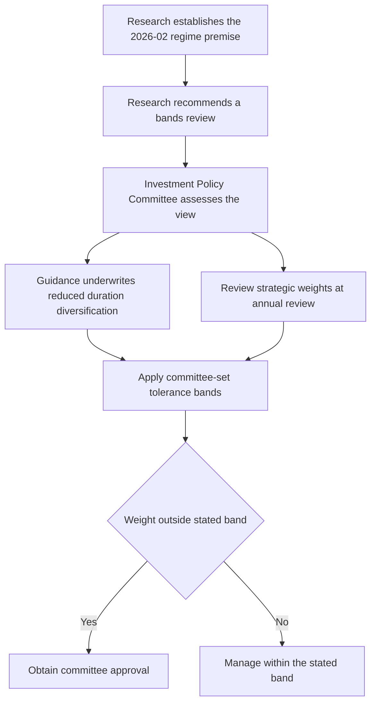

# Global Rates Regime and Strategic-Band Underwriting

## Scope, status, and edition

This page documents the **Multi-Asset Research** framework in *Global Rates Regime and Cross-Asset Implications*, edition **2026-02** (`MA-GL-RATES-REGIME`). It is a global view, published on 2026-02-05 and applicable to positions taken on or after 2026-03-01. The source is a synthetic demonstration document, expressly not research, a recommendation, or client investment advice; within the corpus its stated recommendation is a framework note with no directional recommendation. [Rates-regime note, introduction](repo://internal_research/MA/GL/RATES-REGIME/2026-02.md#L1-L14)

The note is a research input, not a source of portfolio authority. Its operative recommendation is to review the global multi-asset bands against its implications, while expressly reserving the setting of bands to the committee. [Rates-regime note, R.4](repo://internal_research/MA/GL/RATES-REGIME/2026-02.md#L28-L30)

## Regime assumption

The working assumption is a transition away from the post-2010 pattern of persistently negative real short rates. Instead, real short rates are assumed to remain in a **0% to 1.5% band through the cycle**. This is the load-bearing premise for the cross-asset analysis, rather than a forecast for a single policy-rate decision. [Rates-regime note, R.1](repo://internal_research/MA/GL/RATES-REGIME/2026-02.md#L16-L18)

The note names two ways the premise can fail: a demand shock that returns the economy to the post-2010 regime, or fiscal dominance that deliberately holds nominal rates below inflation. Both directly invalidate R.1, although the latter has opposite asset implications. A review should therefore test the premise itself rather than merely ask whether individual asset returns were favorable. [Rates-regime note, R.5](repo://internal_research/MA/GL/RATES-REGIME/2026-02.md#L32-L34)

## Cross-asset implications

Under the assumed higher real-short-rate regime, the note identifies two linked effects: the equilibrium equity risk premium required for duration-like equities is lower, and fixed income is more attractive than it was in the post-2010 experience. Taken together, those effects argue for a higher strategic fixed-income weight than the bands in force through 2023. This is an implication to assess in strategic allocation review, not a self-executing weight change. [Rates-regime note, R.2](repo://internal_research/MA/GL/RATES-REGIME/2026-02.md#L20-L22)

The diversification premise is deliberately more conservative than an extrapolation from the post-2010 sample. Equity-duration correlation has been unstable and has remained positive for extended periods; consequently, the desk does not assume reliably negative stock-bond correlation will return and recommends materially lower underwriting of duration's diversification benefit. [Rates-regime note, R.3](repo://internal_research/MA/GL/RATES-REGIME/2026-02.md#L24-L26)

## From research premise to binding bands

Research and guidance have different responsibilities. The research desk supplies the regime, cross-asset implications, and recommendation to review. The Investment Policy Committee owns strategic weights and tolerance bands; a portfolio manager must not turn a research view into a binding allocation. The guidance explicitly says it acts on this note's R.3 by underwriting duration's contribution to the equity band at a reduced level, and separately says it has accepted R.1 as a working assumption for an annual strategic-weight review. [Rates-regime note, R.1–R.4](repo://internal_research/MA/GL/RATES-REGIME/2026-02.md#L16-L30) [Global Multi-Asset Allocation Bands, B.2–B.5](repo://internal_guidelines/allocation/gl-multi-asset-bands.md#L13-L29)

*Control flow from the research framework to committee-owned guidance and the operating treatment of a band exception.*

The resulting committee decisions must not be reported as research conclusions. In March 2026, the committee adopted the reduced underwriting and, in consequence, set the equity tolerance band at five percentage points rather than the prior seven. The current guidance retains strategic weights of 45% global equities, 35% global fixed income, 10% real assets, and 10% private markets for eligible clients, and says those weights have not yet changed for the rates view; they are scheduled for review at the 2026 annual review. [Global Multi-Asset Allocation Bands, B.2–B.5](repo://internal_guidelines/allocation/gl-multi-asset-bands.md#L13-L29)

The current ordinary bands are ±5 percentage points for global equities and fixed income and ±3 for real assets. A weight outside a stated band requires approval; the authority matrix confirms that band exceptions require committee approval and that mandate-specific bands control where tighter. These are guidance controls, not outputs of edition 2026-02. [Global Multi-Asset Allocation Bands, B.1–B.3](repo://internal_guidelines/allocation/gl-multi-asset-bands.md#L7-L19) [Portfolio Manager Discretion and Escalation Matrix, D.1–D.3](repo://internal_guidelines/authority/discretion-matrix.md#L7-L29)

## Operating and lifecycle controls

Use the research note to frame a review, then apply current allocation guidance to determine what is binding. Do not treat either the higher-fixed-income implication or the reduced correlation underwriting as authorization to alter a strategic weight or a tolerance band. For a historical decision, preserve the research edition that applied when the position was taken; frozen research is published as a new edition rather than edited in place, while living internal guidance can be revised in place. [Corpus conventions](repo://README.md#L41-L48)

If a research note cited by a band is superseded or withdrawn, the band is suspended and returns to its prior committee-adopted level pending review. The manager must escalate rather than carry the prior derived setting forward, re-derive it, or directly adopt a replacement recommendation; the escalation identifies the affected note, replacement where available, derived weights, and accounts. [Global Multi-Asset Allocation Bands, B.1 and B.7](repo://internal_guidelines/allocation/gl-multi-asset-bands.md#L7-L11) [Global Multi-Asset Allocation Bands, B.7](repo://internal_guidelines/allocation/gl-multi-asset-bands.md#L37-L39) [Portfolio Manager Discretion and Escalation Matrix, D.4](repo://internal_guidelines/authority/discretion-matrix.md#L31-L37)

## Focused review checks

| Check | Pass condition |
| --- | --- |
| Edition and scope | The record identifies `MA-GL-RATES-REGIME` edition 2026-02 and uses it only for actions on or after its 2026-03-01 applicability date. |
| Premise test | The review tests whether real short rates plausibly remain in the 0%–1.5% through-cycle band and records either named invalidation route. |
| Diversification test | Duration is not credited using an assumed reliably negative stock-bond correlation or a post-2010 sample alone. |
| Authority test | The file distinguishes the research request to review from the committee's adopted underwriting, weights, and bands; it does not call committee bands a desk recommendation. |
| Exception test | Any proposed departure from a stated band follows the committee-approval path, rather than being justified locally from the research view. |

## Source basis

- [Global Rates Regime and Cross-Asset Implications, edition 2026-02](repo://internal_research/MA/GL/RATES-REGIME/2026-02.md#L1-L36)
- [Global Multi-Asset Allocation Bands](repo://internal_guidelines/allocation/gl-multi-asset-bands.md#L7-L39)
- [Portfolio Manager Discretion and Escalation Matrix](repo://internal_guidelines/authority/discretion-matrix.md#L7-L37)
- [Corpus edition and authority conventions](repo://README.md#L41-L68)
