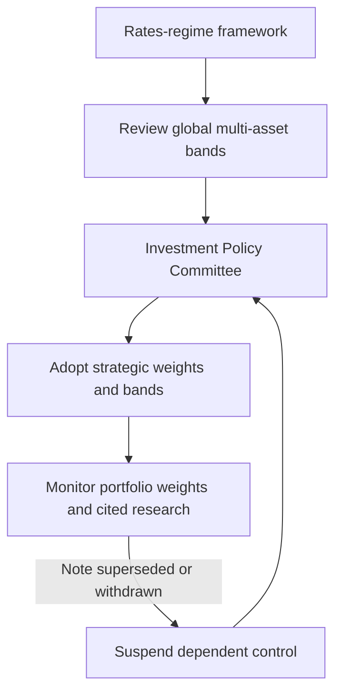

# Global Rates Regime and Cross-Asset Implications

## Edition, applicability, and authority boundary

This page records **MA-GL-RATES-REGIME, Edition 2026-02**, published by Multi-Asset Research on **2026-02-05** and applicable to positions taken on or after **2026-03-01**. The note takes a global view. It is a framework note with no directional recommendation, rather than a mandate-level trading or band instruction.【repo://research/MA/GL/RATES-REGIME/2026-02.md#L7-L14】

Use this page to examine long-run strategic assumptions. For an allowable strategic weight, tolerance band, or an exception, use the separate [Internal Guidance: Global Multi-Asset Bands](/openwiki/guidance/allocation/global-multi-asset-bands.md), whose controls are owned by the Investment Policy Committee.【repo://guidelines/allocation/gl-multi-asset-bands.md#L7-L11】

## Regime framework and cross-asset implications

The desk’s working assumption is a move away from the post-2010 pattern of persistently negative real short rates: real short rates hold in a **0% to 1.5%** band through the cycle.【repo://research/MA/GL/RATES-REGIME/2026-02.md#L16-L18】 This is the load-bearing scenario for the framework, not a promised policy-rate path.

Within that scenario, higher real short rates reduce the equilibrium equity risk premium required to hold duration-like equities and increase fixed income’s attraction relative to the post-2010 experience. The note says these two effects argue for a higher strategic fixed-income weight than the bands in force through 2023.【repo://research/MA/GL/RATES-REGIME/2026-02.md#L20-L22】 The conclusion is an input to a strategic review; it supplies neither a target weight nor an authorization to trade.

## Diversification: do not extrapolate the post-2010 sample

The framework treats duration’s diversifying role separately from fixed income’s relative attractiveness. Equity–duration return correlation has been unstable and positive for extended periods; the desk therefore does not assume reliably negative correlation will return. It recommends underwriting duration’s diversification benefit at a materially lower level than the post-2010 sample would imply.【repo://research/MA/GL/RATES-REGIME/2026-02.md#L24-L26】

Accordingly, a strategic review can find fixed income more attractive in the higher-real-rate regime while granting it less equity-diversification credit. Treating a higher fixed-income weight as proof of a reliably stronger equity hedge would contradict the framework’s stated correlation assumption.【repo://research/MA/GL/RATES-REGIME/2026-02.md#L20-L26】

## Research input versus committee control

This flow shows that the research note recommends review, whereas the Committee owns the adoption of strategic controls; a control based on a cited note follows the guidance’s suspension path when that note is superseded or withdrawn.【repo://research/MA/GL/RATES-REGIME/2026-02.md#L28-L30】【repo://guidelines/allocation/gl-multi-asset-bands.md#L7-L11】

The research explicitly recommends reviewing global multi-asset bands against both its regime and correlation conclusions and explicitly says that it does not set bands: bands are a committee matter.【repo://research/MA/GL/RATES-REGIME/2026-02.md#L28-L30】 The Committee has adopted the reduced duration-diversification underwriting in March 2026; it is why the equity band is 5 points rather than the previous 7 points. The Committee has accepted the R.1 working assumption for assessment at the 2026 annual review, but has not changed the strategic weights for that assumption.【repo://guidelines/allocation/gl-multi-asset-bands.md#L21-L29】

The live committee default is 45% global equities, 35% global fixed income, 10% real assets, and 10% private markets for eligible clients; noneligible clients’ private-markets allocation is reallocated pro rata across liquid sleeves. The ordinary equity and fixed-income bands are ±5 percentage points, and the real-assets band is ±3 points; private markets has no ordinary tradable tolerance band.【repo://guidelines/allocation/gl-multi-asset-bands.md#L13-L19】 These are committee controls, not bands established by this framework note.【repo://research/MA/GL/RATES-REGIME/2026-02.md#L28-L30】

## Review triggers and operating limits

Two outcomes invalidate the R.1 real-short-rate assumption: a demand shock that returns the regime to the post-2010 pattern, and fiscal dominance in which nominal rates are deliberately held below inflation. The latter has opposite asset implications from the demand-shock case.【repo://research/MA/GL/RATES-REGIME/2026-02.md#L32-L34】 Record which outcome is being considered when challenging the scenario; the note does not supply a replacement portfolio weight for either outcome.

A band that rests on a research note is suspended when that note is superseded or withdrawn and returns to the prior committee-adopted level pending review.【repo://guidelines/allocation/gl-multi-asset-bands.md#L7-L11】 The bands guidance is reviewed annually and out of cycle whenever cited research is re-issued or withdrawn.【repo://guidelines/allocation/gl-multi-asset-bands.md#L37-L39】 A manager must not treat a replacement research recommendation as a live band: when a cited note is superseded or withdrawn, the manager escalates rather than re-derives the weight, and adopting a binding replacement is a Committee act.【repo://guidelines/authority/discretion-matrix.md#L31-L37】

## Practical use

Use Edition 2026-02 to test strategic real-rate, equity-risk-premium, and stock–bond-correlation assumptions. Do not use it alone to set a portfolio weight, calculate a successor band, or override the Committee’s live guidance. For a separate, tactical US duration and curve research expression, see [US Duration and Curve Positioning](/openwiki/research/fixed-income/duration-and-curve.md).
