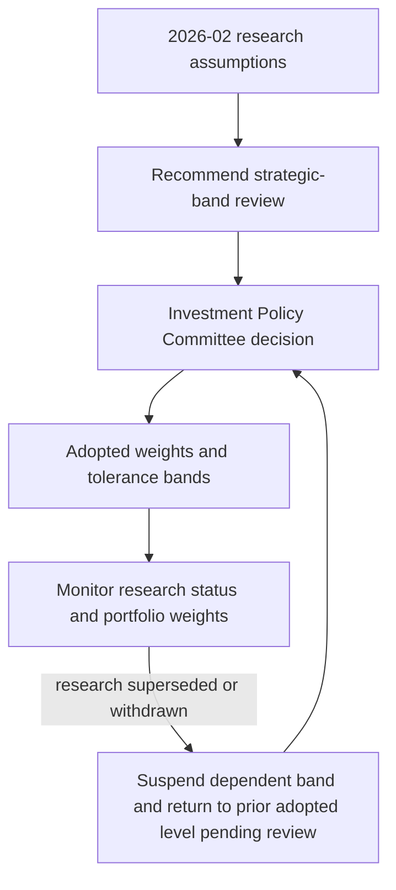

# Global Rates Regime: 2026-02 View

## Decision summary and scope

**Edition 2026-02** was published by Multi-Asset Research on 2026-02-05 and applies to positions taken on or after 2026-03-01. It is a global, strategic research view—not a client recommendation, a tactical duration instruction, or a portfolio-control document.

The working assumption is that the policy-rate regime has shifted away from the post-2010 pattern of persistently negative real short rates. Through the cycle, real short rates are assumed to remain in a **0% to 1.5%** band. This is an assumption to test in portfolio review, not a forecast certainty.

## Cross-asset implications

A higher real short-rate regime has two linked implications in this note:

1. It reduces the equilibrium equity risk premium needed to hold duration-like equities.
2. It makes fixed income more attractive relative to the post-2010 experience.

Together, these effects support reviewing whether strategic fixed-income weight should be higher than the bands that were in force through 2023. They do **not** specify a target weight, a trade, a benchmark-relative duration position, or a new tolerance band. For a separate US tactical duration and curve expression, see [US Duration and Curve: 2026-01 View](/openwiki/research/fixed-income/duration-and-curve.md).

## Diversification assumption

The note does not assume that duration will again provide reliably negative equity correlation. Equity–duration return correlation has been unstable and has remained positive for extended periods. Therefore, underwrite duration’s diversification benefit at a materially lower level than the post-2010 sample would imply.

This is deliberately a resilience assumption: fixed income can be relatively more attractive in a higher-real-rate regime while still receiving less diversification credit in equity-band design. The two conclusions address different portfolio roles and should not be collapsed into a claim that more duration automatically supplies stronger equity protection.

## From research input to committee control

This flow separates the research recommendation from the committee-owned adoption and the review required when cited research changes.

The note recommends that the global multi-asset bands be reviewed against both the higher-real-rate implications and the reduced diversification underwriting; it does not itself set portfolio bands. The Investment Policy Committee owns the strategic weights and band decisions. Under the current committee guidance, the committee adopted the reduced duration-diversification underwriting in March 2026, which supports the current 5-percentage-point equity band rather than the prior 7-point band. It has accepted this note’s working assumption for assessment at the 2026 annual review, but has **not** changed the strategic weights for that assumption.

Accordingly, a portfolio manager must use the committee’s live guidance—not this note—to determine allowable weights and exceptions. The current strategic default is 45% global equities, 35% global fixed income, 10% real assets, and 10% private markets for eligible clients; the ordinary equity and fixed-income tolerance bands are ±5 percentage points. Those are committee controls, not recommendations issued by this research note. See [Internal Guidance: Global Multi-Asset Bands](/openwiki/guidance/allocation/global-multi-asset-bands.md).

## Invalidation risks and review triggers

Two stated outcomes directly invalidate the R.1 real-short-rate assumption:

- **Demand shock:** a return to the post-2010 regime through a demand shock.
- **Fiscal dominance:** nominal rates deliberately held below inflation. This also invalidates R.1, but has opposite asset implications from the demand-shock case.

The committee guidance also gives the research dependency an operating consequence: a band based on a research note is suspended if that note is superseded or withdrawn and returns to the prior committee-adopted level pending review. A research reissue or withdrawal is therefore a review trigger, not authority for a manager to calculate a replacement weight or revive a former band.

## Practical use and limits

Use this edition to challenge long-run allocation and correlation assumptions, especially where models embed the post-2010 negative-real-rate or reliably negative stock–bond-correlation experience. Record the exact real-rate band and the two invalidating risks when using it as an input to strategic review.

Do not use it to:

- infer a mechanical increase in fixed-income allocation;
- turn the 0%–1.5% assumption into a promised policy path;
- assume duration will hedge equities reliably; or
- override committee bands, approval requirements, client eligibility, suitability, or mandate-specific constraints.

## Source basis

- **Regime assumption, implications, diversification recommendation, scope, and invalidating risks:** `research/MA/GL/RATES-REGIME/2026-02.md`, sections R.1–R.5.
- **Committee adoption, current bands, annual-review status, and suspension treatment:** `guidelines/allocation/gl-multi-asset-bands.md`, sections B.1–B.7.
