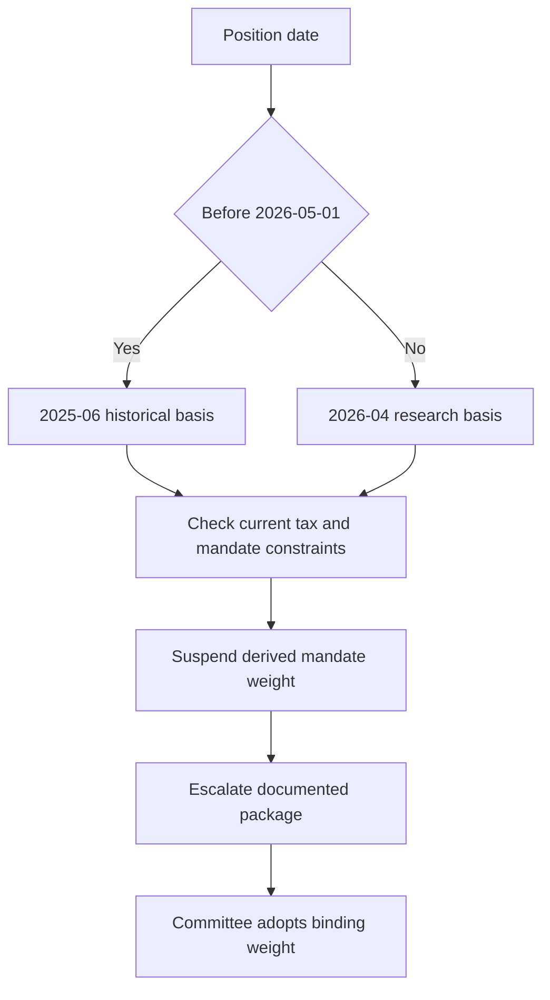

## Purpose and decision boundaries

Use this workflow for a United States taxable fixed-income municipal-credit position that was opened, maintained, changed, or reviewed across the 2025-06/2026-04 research transition. Frozen research and regulator bulletins are published as new editions rather than edited in place; living guidance is revised in place. A frozen edition remains the basis of record for positions taken while it was in force, even when the review occurs later. [Corpus model](repo://README.md#L39-L48)

Keep four decisions distinct: the historical research basis selected by the position date; the tax and mandate constraints applicable to an action; the desk's replacement research; and committee adoption of a binding portfolio weight. The taxable fixed-income guide sets binding weights and may not assert a view unsupported by research, while the discretion matrix permits a mandate to be tighter and prohibits discretionary approval of a stated regulatory breach. [Taxable guide purpose](repo://guidelines/allocation/us-taxable-fixed-income.md#L1-L5) [Discretion matrix D.1](repo://guidelines/authority/discretion-matrix.md#L7-L11) [Discretion matrix D.5](repo://guidelines/authority/discretion-matrix.md#L39-L47)

## Select the historical edition

For municipal positions taken from **2025-07-01 through 2026-04-30**, record FI-US-MUNI-CREDIT **edition 2025-06** as the edition in force. It applied from 2025-07-01; its explicit supersession notice says that 2026-04 takes effect on 2026-05-01 and that 2025-06 remains the basis of record for positions taken while it stood. FI-US-MUNI-CREDIT edition 2026-04 **supersedes** edition 2025-06 for positions taken on or after **2026-05-01**. [Municipal 2025-06 applicability and notice](repo://research/FI/US/MUNI-CREDIT/2025-06.md#L3-L5) [Municipal 2025-06 publication](repo://research/FI/US/MUNI-CREDIT/2025-06.md#L16-L18) [Municipal 2026-04 applicability and supersession](repo://research/FI/US/MUNI-CREDIT/2026-04.md#L16-L18) [Municipal 2026-04 M.1](repo://research/FI/US/MUNI-CREDIT/2026-04.md#L22-L27)

The historical 2025-06 record is an overweight thesis: a two-to-four percentage-point municipal increase funded from investment-grade corporate credit, with the size dependent on its after-tax premise rather than credit fundamentals alone. In the taxable guide, that became a 22% municipal target versus 18% neutral for top-bracket clients, paired with a 28% investment-grade-corporate target versus 32% neutral. Preserve those facts as the historical basis; do not rewrite them to neutral merely because the later note exists. [Municipal 2025-06 M.1–M.3](repo://research/FI/US/MUNI-CREDIT/2025-06.md#L20-L24) [Municipal 2025-06 M.2–M.3](repo://research/FI/US/MUNI-CREDIT/2025-06.md#L26-L40) [Taxable guide A.3](repo://guidelines/allocation/us-taxable-fixed-income.md#L17-L23) [Taxable guide A.5](repo://guidelines/allocation/us-taxable-fixed-income.md#L33-L37)

This flow shows date-based historical selection and the separate suspension and committee-adoption path after supersession. [Municipal 2025-06 notice](repo://research/FI/US/MUNI-CREDIT/2025-06.md#L3-L5) [Municipal 2026-04 M.1](repo://research/FI/US/MUNI-CREDIT/2026-04.md#L22-L27) [Discretion matrix D.4](repo://guidelines/authority/discretion-matrix.md#L31-L35)

## Apply current constraints without rewriting history

Revenue Procedure 2025-41 applies to taxable years beginning on or after **2026-01-01**. It sets AMT phase-out thresholds at $500,000 for an unmarried taxpayer and $1,000,000 for a joint return, and states that those thresholds are not indexed before 2030. This tax-date boundary precedes the 2026-05-01 research-edition boundary, so it is a current overlay on actions and review rather than a retroactive replacement of the recorded 2025-06 edition. [Revenue Procedure N.1–N.3](repo://bulletins/IRS/2025-08-rev-proc-2025-41-amt-thresholds.md#L8-L22) [Municipal 2026-04 publication](repo://research/FI/US/MUNI-CREDIT/2026-04.md#L16-L18) [Municipal 2025-06 notice](repo://research/FI/US/MUNI-CREDIT/2025-06.md#L3-L5)

The 2025-06 note identified a reduced AMT phase-out threshold as the risk that invalidates its load-bearing after-tax premise and required immediate review and re-issue for a change to that treatment. The 2026-04 note attributes its out-of-cycle reissue to Revenue Procedure 2025-41 and concludes that the broader AMT-affected population eliminates the overweight's supporting advantage. [Municipal 2025-06 M.2](repo://research/FI/US/MUNI-CREDIT/2025-06.md#L26-L34) [Municipal 2025-06 M.7–M.8](repo://research/FI/US/MUNI-CREDIT/2025-06.md#L60-L74) [Municipal 2026-04 publication](repo://research/FI/US/MUNI-CREDIT/2026-04.md#L16-L18) [Municipal 2026-04 M.2](repo://research/FI/US/MUNI-CREDIT/2026-04.md#L29-L53)

Revenue Procedure 2025-41 preserves the AMT preference treatment for specified private-activity-bond interest and the qualified-501(c)(3) exception. Accordingly, the 2026-04 research withdraws the broad private-activity concentration but retains a modest preference for qualified 501(c)(3) hospital and private-higher-education obligations; it withdraws the airport special-facility preference. This is replacement research, not itself a mandate instruction. [Revenue Procedure N.4–N.5](repo://bulletins/IRS/2025-08-rev-proc-2025-41-amt-thresholds.md#L24-L34) [Municipal 2026-04 M.1](repo://research/FI/US/MUNI-CREDIT/2026-04.md#L20-L27) [Municipal 2026-04 M.3–M.4](repo://research/FI/US/MUNI-CREDIT/2026-04.md#L55-L77)

## Suspend, escalate, and re-adopt

The taxable fixed-income guide states that a weight derived from a superseded or withdrawn cited note is suspended, not carried forward, until the committee re-adopts it against the replacement. The discretion matrix requires the manager to escalate rather than re-derive the weight, carry the prior weight forward, or directly adopt the replacement recommendation. Thus the 2026-04 neutral research view does not automatically convert the guide's historical 22% target into a new binding target. [Taxable guide A.1](repo://guidelines/allocation/us-taxable-fixed-income.md#L7-L11) [Taxable guide A.3](repo://guidelines/allocation/us-taxable-fixed-income.md#L17-L23) [Discretion matrix D.4](repo://guidelines/authority/discretion-matrix.md#L31-L37)

Suspend the municipal overweight and its paired investment-grade-corporate underweight together; the guide returns both to neutral. A resulting tolerance-band breach is not ordinary market drift and must not be mechanically rebalanced, because the correct replacement weight is a committee decision. The replacement note's recommendation against forced sales informs research analysis, but does not eliminate the mandate suspension or escalation requirement. [Taxable guide A.5–A.6](repo://guidelines/allocation/us-taxable-fixed-income.md#L33-L43) [Municipal 2026-04 M.4](repo://research/FI/US/MUNI-CREDIT/2026-04.md#L69-L78)

Prepare an escalation naming the superseded note, replacement note, every derived weight, and affected accounts. If cleared, retain the condition, clearing authority level, facts relied upon, and date; audit treats a clearance without recorded basis as an unapproved position. The committee then evaluates the replacement research and current constraints and expressly adopts any new binding weight. [Discretion matrix D.4](repo://guidelines/authority/discretion-matrix.md#L31-L35) [Discretion matrix D.6](repo://guidelines/authority/discretion-matrix.md#L49-L51)

### Operator checklist

- Record the position date, mandate, edition in force, cited sections, thesis assumptions, and invalidation trigger. [Municipal 2025-06 M.2 and M.8](repo://research/FI/US/MUNI-CREDIT/2025-06.md#L26-L34) [Municipal 2025-06 M.8](repo://research/FI/US/MUNI-CREDIT/2025-06.md#L72-L74)
- Apply Revenue Procedure 2025-41 from the 2026-01-01 taxable-year boundary and the mandate guide in force for the action; retain, rather than overwrite, the historical edition selected by the position date. [Revenue Procedure N.1](repo://bulletins/IRS/2025-08-rev-proc-2025-41-amt-thresholds.md#L8-L12) [Corpus model](repo://README.md#L41-L48)
- For the 2025-06 municipal-derived targets, suspend the municipal and linked corporate offsets together, document the D.4 package, and wait for committee re-adoption before setting a new binding weight. [Taxable guide A.1 and A.5–A.6](repo://guidelines/allocation/us-taxable-fixed-income.md#L7-L11) [Taxable guide A.5–A.6](repo://guidelines/allocation/us-taxable-fixed-income.md#L33-L43) [Discretion matrix D.4](repo://guidelines/authority/discretion-matrix.md#L31-L37)
