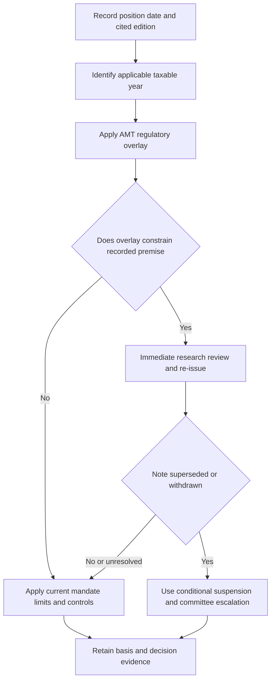

## Purpose and record boundary

Use this procedure when opening, changing, maintaining, or reviewing United States municipal-credit exposure in a taxable fixed-income account. It creates a position basis of record: a dated record of what research supported the historical position, what living guidance governed the account action, and what regulatory facts must be considered for the applicable tax year. It is not a mechanism for backdating a later conclusion into the historical record.

The corpus deliberately separates **frozen authority** from **living guidance**. Published research and regulator documents are not edited in place; a later edition would be a new file, while internal guidelines are revised in place. Thus, retain the research edition that stood when the position was taken as historical evidence even when reviewing it later. [Corpus authority model](repo://README.md#L39-L48) [Municipal research status and applicability](repo://internal_research/FI/US/MUNI-CREDIT/2025-06.md#L12-L16)

Keep these owners and decisions separate:

- **Research edition:** identifies the desk thesis and its stated assumptions as of the position date.
- **Regulatory overlay:** identifies tax treatment applicable to the client’s taxable year; it does not select an allocation weight.
- **Living allocation guide:** sets the default account weights and implementation limits that a portfolio manager may hold without escalation.
- **Authority process:** determines whether an exception or a future research supersession requires approval; it cannot clear a stated regulatory breach. [Allocation guide standing](repo://internal_guidelines/allocation/us-taxable-fixed-income.md#L7-L11) [Discretion matrix D.1 and D.5](repo://internal_guidelines/authority/discretion-matrix.md#L7-L11) [Discretion matrix D.5](repo://internal_guidelines/authority/discretion-matrix.md#L39-L47)

## 1. Establish the historical research basis

Record the position date first. FI-US-MUNI-CREDIT **2025-06** was published on 2025-06-12 and applies to positions taken on or after **2025-07-01**. It is currently marked “Current” and “Not re-issued since publication.” For a position within that applicability, record this edition—not a hypothetical replacement—as the historical municipal research basis. If a position predates that date, identify the actually applicable authority rather than inferring it from this note. [Municipal research status and applicability](repo://internal_research/FI/US/MUNI-CREDIT/2025-06.md#L12-L16)

Capture the cited thesis precisely. The note moved municipal credit from neutral to overweight, expressed as a two-to-four percentage-point increase funded from investment-grade corporate credit. Its load-bearing case is after-tax treatment for top-bracket holders; its credit fundamentals alone support only neutral to modest overweight. The guide implements that view for top-bracket accounts as 22% municipal versus 18% neutral and 28% investment-grade corporate versus 32% neutral. These are historical research and current-guide facts, respectively; do not relabel the historical thesis as a new decision. [Municipal research M.1–M.3](repo://internal_research/FI/US/MUNI-CREDIT/2025-06.md#L18-L38) [Allocation guide A.3 and A.5](repo://internal_guidelines/allocation/us-taxable-fixed-income.md#L17-L23) [Allocation guide A.5](repo://internal_guidelines/allocation/us-taxable-fixed-income.md#L33-L37)

The basis record should include the position and action dates, account tax-bracket classification, edition and sections relied upon, stated thesis and invalidation trigger, current guide version/sections, holdings affected, and any approval or review record. This makes a later review reproducible without altering the contemporaneous rationale.

## 2. Apply the tax overlay by taxable-year date

Revenue Procedure 2025-41 applies to taxable years beginning on or after **2026-01-01**. For those tax years, its AMT exemption phase-out begins above $500,000 of AMTI for an unmarried individual and $1,000,000 for a joint return; those thresholds are not indexed before taxable years beginning in 2030. Apply this overlay according to the client’s taxable-year facts. It does not change which research edition was historical evidence for a position date. [Revenue Procedure 2025-41 N.1–N.3](repo://external_sources/IRS/2025-08-rev-proc-2025-41-amt-thresholds.md#L8-L22)

The overlay is material because 2025-06 identifies a reduced phase-out threshold that draws materially more top-bracket holders into AMT as the event that defeats its after-tax rationale. The note requires immediate review and re-issue when the federal tax treatment described in its after-tax case changes. The overlay does not change the underlying bond classifications: specified private-activity-bond interest remains an AMT preference item, while qualified-501(c)(3) bond interest remains excepted. Evaluate the applicable taxpayer and bond facts rather than treating all private-activity exposure alike. [Municipal research M.2, M.7–M.8](repo://internal_research/FI/US/MUNI-CREDIT/2025-06.md#L24-L32) [Municipal research M.7–M.8](repo://internal_research/FI/US/MUNI-CREDIT/2025-06.md#L58-L72) [Revenue Procedure 2025-41 N.4–N.5](repo://external_sources/IRS/2025-08-rev-proc-2025-41-amt-thresholds.md#L24-L34) [Municipal research M.5](repo://internal_research/FI/US/MUNI-CREDIT/2025-06.md#L46-L52)

This is the **unresolved premise conflict**: the regulatory overlay constrains a load-bearing premise of research that remains marked current and not re-issued, while the living guide continues to cite that research as the basis for its municipal target. Do not infer a replacement research recommendation, a new binding weight, or an automatic suspension. Immediate research review and re-issue is the note’s stated lifecycle response; any current account action remains subject to the existing mandate limits and approval triggers. The repository evidence does not supply a completed re-issue, a committee disposition, or a replacement target. [Municipal research status and M.8](repo://internal_research/FI/US/MUNI-CREDIT/2025-06.md#L12-L16) [Municipal research M.8](repo://internal_research/FI/US/MUNI-CREDIT/2025-06.md#L70-L72) [Allocation guide A.1, A.3 and A.8](repo://internal_guidelines/allocation/us-taxable-fixed-income.md#L7-L11) [Allocation guide A.3 and A.8](repo://internal_guidelines/allocation/us-taxable-fixed-income.md#L17-L23) [Allocation guide A.8](repo://internal_guidelines/allocation/us-taxable-fixed-income.md#L49-L51) [Discretion matrix D.3](repo://internal_guidelines/authority/discretion-matrix.md#L17-L29)

This decision sequence preserves the historical basis, applies the overlay by taxable year, and keeps the unresolved-premise path separate from the conditional superseded-or-withdrawn control. It does not prescribe an unissued research disposition. [Municipal research M.2 and M.8](repo://internal_research/FI/US/MUNI-CREDIT/2025-06.md#L24-L32) [Municipal research M.8](repo://internal_research/FI/US/MUNI-CREDIT/2025-06.md#L70-L72) [Allocation guide A.1](repo://internal_guidelines/allocation/us-taxable-fixed-income.md#L7-L11) [Discretion matrix D.4](repo://internal_guidelines/authority/discretion-matrix.md#L31-L37)

## 3. Apply current living guidance before acting

For a top-bracket account, apply the guide’s current 22% municipal target and 18% neutral reference, subject to its sector and duration controls. The private-activity concentration and the guide’s sector preferences are binding limits: no preferred sector may exceed 35% of municipal allocation, restricted sectors require approval, and municipal duration is held in the eight-to-fifteen-year band. The linked corporate target is 28% against 32% neutral. [Allocation guide A.3–A.5](repo://internal_guidelines/allocation/us-taxable-fixed-income.md#L17-L35) [Allocation guide A.4](repo://internal_guidelines/allocation/us-taxable-fixed-income.md#L25-L31)

At month end, ordinary market-value drift outside the plus-or-minus-two-point tolerance band is rebalanced in the next monthly cycle. A mandate-specific limit can be tighter than the discretion matrix and controls in that case. Any proposed action that would breach a stated regulatory requirement cannot be cleared as an investment-discretion exception. [Allocation guide A.6](repo://internal_guidelines/allocation/us-taxable-fixed-income.md#L39-L43) [Discretion matrix D.1 and D.5](repo://internal_guidelines/authority/discretion-matrix.md#L7-L11) [Discretion matrix D.5](repo://internal_guidelines/authority/discretion-matrix.md#L39-L47)

## 4. Use the supersession control only when its condition occurs

The guide and discretion matrix provide a distinct, conditional path **only if** a mandate-cited research note is superseded or withdrawn. In that event, suspend the derived weight rather than carrying it forward; escalate to the committee, identify the superseded note, replacement if one exists, all derived weights, and affected accounts, and do not directly adopt replacement research. For the municipal/corporate pair, the guide says suspension returns both the municipal overweight and corporate underweight to neutral, and a resulting band condition is not automatically rebalanced. [Allocation guide A.1 and A.5–A.6](repo://internal_guidelines/allocation/us-taxable-fixed-income.md#L7-L11) [Allocation guide A.5–A.6](repo://internal_guidelines/allocation/us-taxable-fixed-income.md#L33-L43) [Discretion matrix D.4](repo://internal_guidelines/authority/discretion-matrix.md#L31-L37)

That is a future conditional control, not a finding that it has occurred here. The available facts instead say the municipal note is current and not re-issued; Revenue Procedure 2025-41 supersedes a section of an earlier revenue procedure, not this note or the guide. If an escalation is cleared, record the condition, authority level, facts relied upon, and date; audit treats a clearance without recorded basis as unapproved. [Municipal research status](repo://internal_research/FI/US/MUNI-CREDIT/2025-06.md#L12-L16) [Revenue Procedure 2025-41 N.1 and N.7](repo://external_sources/IRS/2025-08-rev-proc-2025-41-amt-thresholds.md#L10-L12) [Revenue Procedure 2025-41 N.7](repo://external_sources/IRS/2025-08-rev-proc-2025-41-amt-thresholds.md#L40-L42) [Discretion matrix D.6](repo://internal_guidelines/authority/discretion-matrix.md#L49-L51)

## Review checklist

1. Preserve the position-date research edition and its stated assumptions; do not overwrite historical evidence.
2. Determine whether the client’s taxable year is within the Revenue Procedure 2025-41 effective period and evaluate its AMT facts.
3. For a taxable year in the overlay’s effective period, record the taxpayer and bond-treatment facts and the effect on the still-current 2025-06 threshold premise; send the change to the note’s immediate research-review and re-issue lifecycle without inventing a replacement view or weight.
4. Before any action, apply current account classification, mandate weights, sector limits, duration band, tolerance treatment, and authority restrictions. Obtain approval only when the applicable current-action trigger requires it; approval cannot clear a stated regulatory breach.
5. Retain the factual review, approvals, and rationale with the position record. Only if a cited note is actually superseded or withdrawn later, use the separate D.4 suspension-and-committee path.
