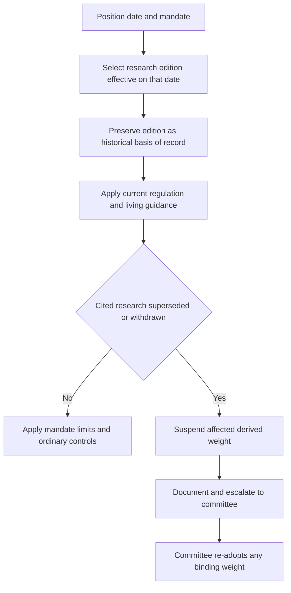

## Purpose and governing layers

This workflow is for assembling the authority for a proposed position, maintaining an existing one, or reviewing a historical decision. It applies the corpus's separation of **frozen authority**—published research and regulator bulletins that are not edited in place—from **living guidance**, which is revised in place. A frozen edition is historical evidence, not stale content: a position taken in 2025 is reviewed against the 2025 research edition even if the review happens in 2027. [Corpus model](repo://README.md#L39-L48)

The result is not a research recommendation alone. Research supplies an analytical basis; the governing mandate guide supplies binding portfolio weights and limits; the discretion matrix caps manager authority, while allowing a mandate to be tighter. Regulatory requirements and regulatory eligibility determinations are outside investment discretion and cannot be cured by approval. [Taxable guide A.1](repo://guidelines/allocation/us-taxable-fixed-income.md#L7-L11) [Discretion matrix D.1, D.5](repo://guidelines/authority/discretion-matrix.md#L7-L11) [Discretion matrix D.5](repo://guidelines/authority/discretion-matrix.md#L39-L47)

## Assemble the record at the position date

1. **Identify the position date and scope.** Locate the relevant research series, asset/market scope, and the edition that applied when the position was taken. Research editions publish their applicability dates; for example, semiconductor-capex edition 2025-06 applies to positions taken on or after 2025-07-01, while edition 2026-02 applies from 2026-03-01. [Semiconductor 2025-06 applicability](repo://research/EQ/US/SEMI-CAPEX/2025-06.md#L19-L19) [Semiconductor 2026-02 applicability](repo://research/EQ/US/SEMI-CAPEX/2026-02.md#L12-L14)
2. **Freeze the analytical basis.** Retain the selected edition, its recommendation, stated assumptions, implementation limits, and invalidation or review triggers in the position record. Do not substitute a later edition merely because it is now current. The superseded semiconductor 2025-06 edition expressly remains the basis of record for positions taken while it stood, regardless of the later review date. [Semiconductor 2025-06 supersession notice](repo://research/EQ/US/SEMI-CAPEX/2025-06.md#L3-L5)
3. **Map the research into its mandate implementation.** Determine whether and how a living guide implements the research as a target, band, sector limit, or other constraint. The US taxable fixed-income guide, for example, implements the 2025-06 municipal research as a 22% target for eligible top-bracket accounts, while research itself calls for a two-to-four-point increase funded from investment-grade credit. [Taxable guide A.3](repo://guidelines/allocation/us-taxable-fixed-income.md#L17-L23) [Municipal research M.1](repo://research/FI/US/MUNI-CREDIT/2025-06.md#L16-L20)
4. **Apply the current overlays before action.** Read the current regulator bulletin and living guidance applicable to the action date. An overlay can constrain whether and how a historical research thesis may be used without retroactively changing the historical basis of record. The manager must use the current mandate guide and cannot use research to widen an applicable limit. [Discretion matrix D.1](repo://guidelines/authority/discretion-matrix.md#L7-L11)
5. **Classify the result.** If the frozen research remains the cited basis and current overlays permit the action, follow the mandate's ordinary controls. If research has been superseded or withdrawn, enter the suspension path; do not treat it as ordinary drift or a manager-selectable refresh.

This flow distinguishes the historical edition selected by the position date from the current constraints on an action, and reserves replacement-weight adoption to the committee. [Discretion matrix D.4](repo://guidelines/authority/discretion-matrix.md#L31-L37)

## Current overlays constrain action, not history

A regulatory event can invalidate a research assumption and trigger review. Municipal research 2025-06 identifies the AMT phase-out threshold as its load-bearing after-tax premise and requires immediate review and re-issue for an announced change to the federal tax treatment described in that note. IRS Revenue Procedure 2025-41 applies for taxable years beginning on or after 2026-01-01 and sets phase-out thresholds of $500,000 for unmarried taxpayers and $1,000,000 for joint returns. [Municipal research M.2, M.8](repo://research/FI/US/MUNI-CREDIT/2025-06.md#L22-L30) [Municipal research M.8](repo://research/FI/US/MUNI-CREDIT/2025-06.md#L68-L70) [Revenue Procedure N.3, N.8](repo://bulletins/IRS/2025-08-rev-proc-2025-41-amt-thresholds.md#L18-L22) [Revenue Procedure N.8](repo://bulletins/IRS/2025-08-rev-proc-2025-41-amt-thresholds.md#L44-L46)

**Relationship — constraint.** Revenue Procedure 2025-41 N.3 **constrains** use of the municipal note's threshold-dependent private-activity-bond thesis for the covered tax years; it does not rewrite the basis recorded for a position established under the earlier edition and it does not prescribe a replacement allocation. The procedure **preserves** the treatment of specified private-activity-bond interest as an AMT preference item and the qualified 501(c)(3) exception, so the review must distinguish a changed AMT population from a change in the underlying preference treatment. [Revenue Procedure N.3–N.5](repo://bulletins/IRS/2025-08-rev-proc-2025-41-amt-thresholds.md#L18-L34) [Municipal research M.2](repo://research/FI/US/MUNI-CREDIT/2025-06.md#L24-L30)

Living guidance is likewise operative at the time of action. It may bind research preferences as limits, as the taxable guide does for municipal sectors, and it may prescribe a periodic or out-of-cycle review when cited research is re-issued or withdrawn. A regulatory eligibility rule remains a separate constraint: private-markets eligibility is determined and documented under compliance guidance, not by a portfolio manager's discretion or research view. [Taxable guide A.4, A.8](repo://guidelines/allocation/us-taxable-fixed-income.md#L25-L31) [Taxable guide A.8](repo://guidelines/allocation/us-taxable-fixed-income.md#L49-L51) [Private-markets eligibility P.1](repo://guidelines/suitability/private-markets-eligibility.md#L7-L9)

## Supersession is a controlled state transition

A supersession marker is a lifecycle signal, not permission to roll a position into the new view. The corpus requires an explicit marker on the former frozen file because detection of a newer authority alone is insufficient. In the representative equity series, edition 2026-02 **supersedes** the 2025-06 overweight edition and changes the desk view to neutral for positions from 2026-03-01; the former edition still governs historical review. [Corpus supersession convention](repo://README.md#L61-L64) [Semiconductor 2025-06 notice](repo://research/EQ/US/SEMI-CAPEX/2025-06.md#L3-L5) [Semiconductor 2026-02 recommendation and applicability](repo://research/EQ/US/SEMI-CAPEX/2026-02.md#L5-L14)

When a manager finds a cited research note superseded or withdrawn, the governing guide suspends the affected research-derived weight. The manager must escalate to the committee; may not carry forward or re-derive the prior weight; and may not directly adopt the replacement recommendation. Turning a research view into a binding mandate weight is a committee act. [Discretion matrix D.4](repo://guidelines/authority/discretion-matrix.md#L31-L37)

The mandate defines the immediate portfolio treatment, including dependencies. The multi-asset guide returns a suspended research-based band to the prior committee-adopted level pending review. In taxable fixed income, suspending the municipal overweight also suspends its paired investment-grade corporate underweight; both return to neutral, preventing an unsupported structural underweight in credit. A suspension-caused breach is not ordinary market drift and is not mechanically rebalanced. [Multi-asset bands B.1](repo://guidelines/allocation/gl-multi-asset-bands.md#L7-L11) [Taxable guide A.5–A.6](repo://guidelines/allocation/us-taxable-fixed-income.md#L33-L43)

## Escalation package and re-adoption

Prepare a committee escalation that identifies the superseded note, the replacement when one exists, every mandate weight derived from it, and every affected account. For a cleared escalation, record the condition, clearing authority level, specific facts relied upon, and date. Missing recorded basis is treated in audit as an unapproved position. [Discretion matrix D.4](repo://guidelines/authority/discretion-matrix.md#L31-L35) [Discretion matrix D.6](repo://guidelines/authority/discretion-matrix.md#L49-L51)

The committee reviews the replacement research together with current overlays and the mandate's linked weights and limits, then expressly re-adopts any binding weight. Do not confuse this with an ordinary band exception: a stated band exception requires committee approval, but a superseded-basis event specifically requires the suspension-and-escalation workflow. No approval path can clear a position that would breach a stated regulatory requirement. [Discretion matrix D.1, D.3–D.5](repo://guidelines/authority/discretion-matrix.md#L7-L11) [Discretion matrix D.3–D.5](repo://guidelines/authority/discretion-matrix.md#L17-L47)

### Operator checklist

- Record position date, mandate, frozen edition, cited provisions, thesis assumptions, and stated invalidation triggers.
- Check current regulatory bulletins and the current living mandate/compliance guidance before executing, maintaining, or changing the position.
- Trace every research-derived target to linked funding trades, bands, and limits so all affected controls are suspended together where the guide requires it.
- On re-issue, withdrawal, or explicit supersession, suspend rather than carry forward; document the required D.4 items; escalate to the committee; and wait for explicit re-adoption.
- Retain the cleared escalation basis. Do not request discretionary clearance for a regulatory prohibition.
